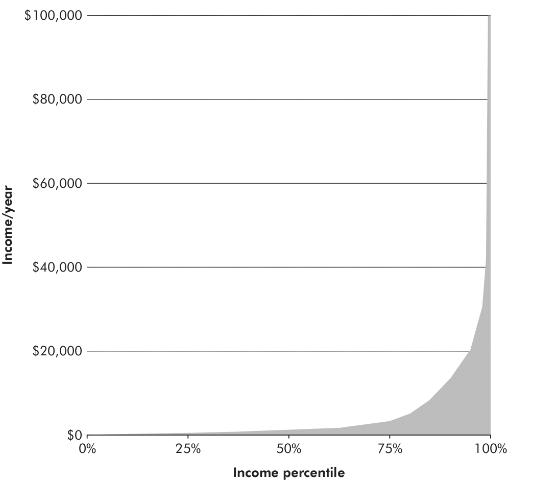

Oxford, 15 janvier 2016

On me demande souvent : « C’est intéressant votre <a href="https://thomassittler.wordpress.com/2016/07/24/quest-ce-que-laltruisme-efficace/">altruisme efficace</a>, mais vous faites quoi, concrètement ? ». Les personnes engagées dans l’altruisme efficace ont une multitude d’occupations et de projets. Mais une chose qu’ils ont pour la plupart  décidé de faire est de donner au moins 10% de leurs revenus à des causes efficaces. En janvier 2016 je me suis engagé, comme plus de 1800 personnes<a href="#_ftn1" name="_ftnref1">[1]</a>, à donner 10%, pour l'ensemble de ma vie professionnelle. J’ai promis de diriger mes dons vers les organisations qui en feront l’usage le plus efficace pour améliorer les vies d’autres êtres sensibles.

La raison de ce choix est que, quand on souhaite faire quelque chose de substantiel pour les autres, donner (intelligemment) une partie de son revenu est bien souvent  la meilleure façon d’aider. L’altruisme efficace encourage à choisir parmi les causes et parmi différentes ONG celles qui auront le plus grand impact, mais aussi à choisir une manière efficace de soutenir ces causes. Dans la grande majorité des cas, votre argent est l’outil le plus puissant, le plus flexible, et le plus simple à utiliser dont vous disposez. Par rapport à un engagement direct comme le bénévolat, un don bien dirigé aura souvent plus d’impact.

Mon but ici n’est pas d’encourager mes lecteurs à devenir plus altruistes, mais simplement offrir des informations qui pourraient guider l’action de certains, selon les valeurs qu’ils portent déjà.
<h1>Puissance</h1>
La distribution mondiale des revenus est extrêmement inégale, ce qui donne de surprenantes opportunités d’impact à tous les habitants des pays riches.

Source: Doing Good Better<a href="#_ftn2" name="_ftnref2">[2]</a>

Quand j’ai pour la première fois découvert ces chiffres, j’ai été surpris de découvrir l’immense richesse relative dont j’ai bénéficié, simplement en étant né dans un pays riche. Même présentés ainsi, ces chiffres ne parviennent pas à nous faire comprendre intuitivement la magnitude de la différence<a href="#_ftn6" name="_ftnref6">[6]</a>. Avec un revenu de 30 653€ par an, vous êtes 50 fois plus riches qu’une personne vivant au seuil de pauvreté de $1,90 par jour; avec le revenu français moyen, 38 fois plus riche<a href="#_ftn7" name="_ftnref7">[7]</a>. Il est difficile de comprendre ce que cela signifie d’être 38 fois plus riche que quelqu’un d’autre, car nous ne rencontrons presque jamais de personnes aussi pauvres dans les pays développés. Avec le salaire d’un seul jour, vous pouvez doubler pendant deux mois le revenu d’une personne vivant au seuil de pauvreté.12,7% de la population mondiale gagne moins de $1,90 par jour<a href="#_ftn3" name="_ftnref3">[3]</a>. Un revenu de 46 000€ ($52 000) par an suffit à faire partie des fameux 1% les plus riches au niveau mondial. Le français moyen, avec un revenu de 23 150€<a href="#_ftn4" name="_ftnref4">[4]</a>, se place dans le 5ème centile. Je vous invite à découvrir votre propre place <a href="https://www.givingwhatwecan.org/get-involved/how-rich-am-i/?country=FRA">avec l'application de Giving What We Can</a>, en entrant votre revenu et votre pays de résidence. Tous ces chiffres prennent déjà en compte le fait que la vie est moins chère dans les pays en développement, en mesurant tous les revenus à la parité de pouvoir d'achat<a href="#_ftn5" name="_ftnref5">[5]</a>.

C’est pour cela que je parle de la puissance du don. Votre argent vous donne une force de frappe considérable. Par rapport à d’autres ressources que vous pourriez utiliser pour aider les autres, votre richesse relative sort du lot. Si vous aidez les habitants d’un village à construire une école, vous n’avez pas 38 fois plus de temps qu’eux, ni 38 fois leur force pour porter des briques. Et si vous faites du soutien scolaire bénévole pour un professeur surchargé, vous n’êtes pas 38 fois meilleur pédagogue que lui. Mais si vous aidez des personnes extrêmement pauvres, vous avez 38 fois plus d’argent qu’eux.

L'exemple de doubler le revenu d’une personne pauvre n’est pas qu’hypothétique. L’organisation <a href="https://www.givedirectly.org/">GiveDirectly</a> envoie sans conditions 1000 dollars à des personnes vivant dans l’extrême pauvreté, via un système de paiements mobile<a href="#_ftn8" name="_ftnref8">[8]</a>. GiveDirectly illustre très simplement comment notre extrême richesse relative peut être utilisée pour aider efficacement d’autres personnes à obtenir une vie meilleure. Mais il est possible de faire mieux encore, avec des organisations mettant en place des programmes considérés comme plus efficaces que les transferts directs d’argent<a href="#_ftn9" name="_ftnref9">[9]</a>. L’évaluateur indépendant GiveWell estime que l’<a href="https://www.againstmalaria.com">Against Malaria Foundation</a>, qui distribue des moustiquaires insecticides au Malawi et en RDC, sauve la vie d’un enfant pour un coût d’environ $3500<a href="#_ftn10" name="_ftnref10">[10]</a>. Ainsi, en donnant 10% de son revenu au cours de sa carrière, il est possible de sauver des dizaines de vies d’enfants.

L’autre manière d’aider est en utilisant son temps. Comparons le don à deux autres manières d’aider les autres: changer de carrière ou faire du bénévolat. Donner 10% de son revenu reviendrait à faire du bénévolat pour l’équivalent de 10% de son temps de travail, disons 4 heures par semaine. Mais les bénévoles n’apportent souvent pas l’aide la plus utile aux ONG. Un bénévole a souvent peu d’expertise dans la tâche qu’il accomplit, et sa supervision coûte du temps aux employés de l’organisation. William MacAskill rapporte que certaines ONG font usage de bénévoles uniquement car ceux-ci, ayant développé des liens personnels, font ensuite des dons<a href="#_ftn11" name="_ftnref11">[11]</a>. Il est donc peu probable que ces quatre heures de volontariat par semaine aient un impact aussi substantiel que celui de donner plusieurs milliers d’euros par an à des ONG efficaces. Au lieu de faire du bénévolat, l’on pourrait travailler quatre heures de plus, afin d’augmenter son salaire et de donner plus, ce qui aiderait une ONG à recruter des employés au lieu de faire usage de bénévoles. Ainsi, le bénévolat peut être une activité enrichissante à titre personnel et un loisir, ou permettre de gagner de l’expérience dans un domaine humanitaire, mais ce n’est pas le meilleur moyen d’avoir un impact positif direct.

Certains changements de carrière peuvent être extrêmement efficaces, et je recommande fortement le travail de <a href="http://80000hours.org/">80 000 Hours</a>, qui propose des conseils de carrière pour un plus grand impact social. Mais pour la majorité d’entre nous, il est difficile d’accéder à une carrière qui permettrait de sauver plusieurs dizaines de vies comme le permet le don. <a href="https://80000hours.org/career-reviews/">Les carrières</a> qu’80 000 Hours recommande le plus fortement ne sont accessibles que pour un petit nombre de personnes: par exemple la création d’une nouvelle ONG aussi efficace que celles recommandées par GiveWell, la recherche en intelligence artificielle, ou le travail d’allocation des fonds dans une grande fondation,<a href="#_ftn12" name="_ftnref12">[12]</a>. Ainsi pour l’immense majorité de ceux qui souhaitent aider les autres, de manière significative mais sans changer de vie, le don apparaît comme la solution la plus puissante.
<h1>Flexibilité</h1>
Le second grand avantage de l’argent par rapport aux autres façons d’aider est qu’il peut être dirigé et redirigé avec précision. J’ai déjà évoqué le fait que le bénévolat est parfois moins utile aux ONG que nous le pensons. Mais le problème est plus grave encore: vous aurez beaucoup de mal à devenir bénévole pour une ONG aussi efficace que celles auxquelles vous pouvez donner. GiveWell ne recommande qu’un petit nombre d’organisations considérées comme les plus efficaces <a href="#_ftn13" name="_ftnref13">[13]</a>. Où que vous soyez dans le monde, vous pouvez agir de manière extrêmement ciblée en faisant un don à l’une d’entre elles. Au contraire, pour trouver une opportunité de volontariat, il faut être au bon endroit, disposer des compétences requises, être disponible sur la bonne plage horaire, etc. Vous risquez ainsi de travailler pour une moins bonne ONG, et même si vous lui apportez un réel service, votre efficacité sera forcément limitée par l’efficacité de l’ONG.

Le même raisonnement s’applique au choix de carrière. En choisissant où donner, votre liberté de choix est totale, alors que votre recherche d’emploi sera forcément limitée par de nombreuses contraintes.

Surtout, le don vous permet de rediriger votre action altruiste chaque année, s’il apparaît de nouveaux éléments de preuve concernant l’efficacité ou non d’une organisation ou d’une cause; ou si vos valeurs changent et vous amènent à favoriser une nouvelle cause. Dans un premier temps, cela veut dire que vous maintenez l’efficacité de vos dons. Par exemple, distribuer des moustiquaires pourrait devenir moins efficace si les besoins les plus pressants sont progressivement remplis par la communauté internationale. Une autre intervention deviendrait alors relativement plus efficace, et vous pourrez facilement pivoter.

Mais surtout, la stratégie du don vous ouvre la possibilité de faire rapidement des changements radicaux dans la cause que vous soutenez. Cela est extrêmement difficile à faire avec sa carrière. Il est en général très coûteux de se réorienter, car il faut redémarrer à zéro sans expérience ni contacts dans un nouveau domaine. Cette capacité à faire le grand saut est un avantage considérable, car comme je l’écrivais <a href="https://thomassittler.wordpress.com/2016/07/24/quest-ce-que-laltruisme-efficace/">ailleurs</a> les plus grandes différences d’efficacité se trouvent entre les causes plutôt qu’entre les interventions au sein d’une cause. Si vous restez à travailler pour une cause 10 fois moins efficace qu’une autre, vous perdez 90% de votre impact potentiel. L’agnosticisme de cause, valeur importante de l’altruisme efficace, est plus difficile à maintenir lorsque l’on a déjà tant investi dans une direction. Nous pouvons le voir à l’aide d’un exemple.

Imaginez qu’une série d’arguments et d’éléments de preuve vous aient convaincu que les animaux ressentent la douleur d’une manière identique aux humains. C’est un exemple d’une considération cruciale<a href="#_ftn14" name="_ftnref14">[14]</a>: la réponse à cette question inverse totalement vos priorités. Vous êtes à présent convaincu qu’il est plusieurs fois plus efficace d’aider des animaux non humains que des humains<a href="#_ftn15" name="_ftnref15">[15]</a>. Si votre contribution altruiste passait jusque là par votre travail dans une ONG innovante distribuant des vaccins, il pourrait vous paraître difficile de faire le changement nécessaire. Par exemple, quitter un poste bien placé et recommencer une carrière en bas de l’échelle, abandonner l’expertise que vous avez développé dans le domaine des vaccins, expliquer à vos amis que vous allez laisser tomber leur cause, et vous détacher de l’identité que vous avez pu construire comme “quelqu’un qui fait de l’humanitaire.” Plus encore, cet effet d’identification à la cause pourrait réduire votre capacité à raisonner de manière impartiale, à prendre en compte toutes les considérations cruciales. Avec le don de 10% de vos revenus, votre flexibilité est au contraire bien plus large, et vous laisse la possibilité de multiplier grandement votre impact en changeant de cause.
<h1>Satisfaction</h1>
J’ai expliqué pourquoi je pense que pour la grande majorité d’entre nous, le don est l’outil le plus efficace dont nous disposons. Notre richesse relative en termes monétaires est immense, alors que notre richesse relative en temps et en expertise est moins écrasante. Par ailleurs, la flexibilité de notre argent vient appuyer cet impact, car il est toujours possible de diriger ses dons précisément là où ils seront le plus efficaces. J’ai terminé l’argument principal de ce texte, mais j'aimerais ajouter quelques notes personnelles sur mon expérience du don.

Ce choix a peu changé ma vie quotidienne. Je continue d’aller au restaurant avec mes amis, de voyager, d’étudier à l’étranger. Mon niveau de vie continue de me placer parmi les 5% les plus riches de la planète. Pourtant je considère cette décision comme un changement important dans ma vie car elle m’a permis de mettre mes actions en meilleur accord avec mes valeurs, bien plus qu’elles ne l’ont jamais été. De plus, avec l’altruisme efficace j’ai découvert une extraordinaire communauté mondiale, pleine d’individus dont l’intelligence, la compassion, et la motivation ne cessent de m’impressionner. Ainsi je ne vois pas ce choix comme un sacrifice mais comme une chance.

Il y a aussi pour moi une grande satisfaction intellectuelle à déterminer, à la manière de l’altruisme efficace, à quelle organisation donner mes 10%. C’est une question nuancée et pluridisciplinaire, mais dont l’impact est réel. Ce n’est plus qu’un exercice académique. Je dois prendre mes idées au sérieux puisque des vies en dépendent.

De manière plus générale, les études en psychologie positive suggèrent qu’une fois que vous avez assez de ressources pour subvenir à vos besoins de base et pour vous faire plaisir de temps en temps, gagner plus d’argent n’a qu’un effet négligeable sur le degré de satisfaction qu'apporte votre vie. Donner semble au contraire rendre plus heureux<a href="#_ftn16" name="_ftnref16">[16]</a>.
<h1>La <em>Pledge </em>de Giving What We Can</h1>
J’ai expliqué pourquoi donner 10% de son revenu, mais pourquoi en faire un choix si public, en m’engageant avec la <em>Pledge<a href="#_ftn17" name="_ftnref17"><strong>[17]</strong></a> </em>de l’organisation Giving What We Can?

Tout d’abord, il serait facile, quand la vie suit son cours, d’oublier mes vraies valeurs, celles dont je vois qu’elles sont les miennes lorsque j’y réfléchis à tête reposée. Cela ne veut pas dire que je me lie les mains au cas où je deviendrais plus égoïste plus tard. La réalité est plus subtile. Tous les faits que je viens de décrire perdent leur prééminence dans la vie quotidienne. Il devient facile d’oublier de donner une fois, puis une autre, même si en réalité on souhaite le faire. M’engager à donner offre une manière simple de codifier mon choix, d’en faire une habitude pour la vie.

Ensuite, cet engagement remplit un rôle social important. C’est l’opportunité de lancer des conversations sur le don efficace, et de normaliser le fait de donner une portion significative de son revenu. Mon but à long terme serait que de donner 10% de son revenu à des organisations efficaces devienne une sorte d’action par défaut pour tous ceux qui souhaitent faire un effort sérieux pour aider les autres. Je pense que cette action par défaut, simple et clairement définie, peut être la solution face aux deux raisons principales qui amènent tant d’entre nous à vivre en dissonance cognitive entre nos valeurs et nos actions. Face à l’énormité de la souffrance qui existe dans le monde, quasiment tout un chacun souhaite aider, au fond. Je soupçonne que la plupart d’entre nous n’agissent pas pour deux raisons principales. Premièrement, un sentiment d’impuissance. Que puis-je faire, seul, contre toutes les famines et tous les ouragans? Deuxièmement, le fait de se sentir désemparé devant la multitude de choix possibles, qui est paralysante. Plutôt que de décider laquelle soutenir entre les centaines d’ONG qui nous sollicitent, il est plus simple de ne rien faire. Devant ces difficultés, il est compréhensible que nous soyons souvent amenés à faire comme si nos instincts altruistes n’étaient pas présents, à les recouvrir de cynisme, et à retourner à notre quotidien.

Mais observez ce qui se passe lorsque chacun sait que l’action “par défaut” dans cette situation est de donner 10% de son revenu à des ONG efficaces telles que celles recommandées par GiveWell. Le sentiment d’impuissance est remplacé par l’opportunité d’un héroïsme ordinaire: vous pouvez réellement sauver des vies. Le désir d’abandonner devant un choix immensément complexe est contrecarré par la possibilité de suivre les recommandations de <a href="http://www.givewell.org/">ceux qui ont consacré des milliers d’heures de recherche</a> à cette question. Nous pouvons baisser la garde du cynisme et retrouver nos valeurs.
<h1>Notes</h1>
<a href="#_ftnref1" name="_ftn1">[1]</a> <a href="https://www.givingwhatwecan.org/about-us/members/">Voir</a> la liste des membres de Giving What We Can et leur dons.

<a href="#_ftnref2" name="_ftn2">[2]</a> William MacAskill, <em>Doing Good Better, </em>Chapitre 1 (<a href="https://www.amazon.fr/Doing-Good-Better-Effective-Difference-ebook/dp/B00XGX17IM/ref=sr_1_1?s=english-books&ie=UTF8&qid=1472818976&sr=1-1&keywords=doing+good+better">Amazon</a>). Les données utilisées par l’auteur pour produire ce graphique proviennent de plusieurs sources. Entre le premier et le 21ème centile des plus riches, les données proviennent d’enquêtes auprès des ménages apportées par Branko Milanovic (voir par exemple <a href="https://drive.google.com/open?id=0B16cnVspvUSLRi1JN2M3T2xMQWs">Milanovic 2012</a>). Pour les 73% les plus pauvres, les données proviennent de l'initiative <a href="http://iresearch.worldbank.org/PovcalNet/">PovcalNet</a> de la Banque Mondiale. Pour les 0.1% les plus riches, le chiffre provient de <em>The Haves and the Have-Nots: A Brief and Idiosyncratic History of Global Inequality</em>, Branko Milanovic.

<a href="#_ftnref3" name="_ftn3">[3]</a> <a href="http://www.banquemondiale.org/fr/topic/poverty/overview">Pauvreté, Vue d’ensemble. Banque Mondiale.</a> (<a href="http://web.archive.org/web/20160331132201/http:/www.banquemondiale.org/fr/topic/poverty/overview">archive</a>)

<a href="#_ftnref4" name="_ftn4">[4]</a> Le revenu moyen France en 2013 était de 23 150€, voir: <a href="http://www.insee.fr/fr/themes/detail.asp?reg_id=0&ref_id=ir-irsocerfs2013&page=irweb/irsocerfs2013/dd/irsocerfs2013_sl.htm">INSEE, </a><a href="http://www.insee.fr/fr/themes/detail.asp?reg_id=0&ref_id=ir-irsocerfs2013&page=irweb/irsocerfs2013/dd/irsocerfs2013_sl.htm"><em>TNV01MO - Niveau de vie annuel moyen des individus selon le type de ménage</em></a> (<a href="http://web.archive.org/web/20160902121044/http:/www.insee.fr/fr/themes/detail.asp?reg_id=0&ref_id=ir-irsocerfs2013&page=irweb/irsocerfs2013/dd/irsocerfs2013_sl.htm">archive</a>). Le revenu médian en 2013 était de 20 000€, voir: <a href="http://www.insee.fr/fr/themes/detail.asp?reg_id=0&ref_id=ir-irsocerfs2013&page=irweb/irsocerfs2013/dd/irsocerfs2013_sl.htm">INSEE, </a><a href="http://www.insee.fr/fr/themes/detail.asp?reg_id=0&ref_id=ir-irsocerfs2013&page=irweb/irsocerfs2013/dd/irsocerfs2013_sl.htm"><em>DNV01 - Distribution des niveaux de vie annuels des individus</em></a> (<a href="http://web.archive.org/web/20160902121044/http:/www.insee.fr/fr/themes/detail.asp?reg_id=0&ref_id=ir-irsocerfs2013&page=irweb/irsocerfs2013/dd/irsocerfs2013_sl.htm">archive</a>). Voir la définition du <a href="http://www.insee.fr/fr/methodes/default.asp?page=definitions/niveau-de-vie.htm">niveau de vie</a> (<a href="http://web.archive.org/web/20160503233606/http:/www.insee.fr/fr/methodes/default.asp?page=definitions/niveau-de-vie.htm">archive</a>).

<a href="#_ftnref5" name="_ftn5">[5]</a> <a href="https://fr.wikipedia.org/wiki/Parit%C3%A9_de_pouvoir_d%27achat">Parité de pouvoir d’achat, Wikipédia.</a>

<a href="#_ftnref6" name="_ftn6">[6]</a> C’est pourquoi par exemple il si difficile de comprendre que les ateliers textiles payant une misère sont un emploi rêvé pour tant de victimes de la pauvreté, voir: <a href="http://www.nytimes.com/2009/01/15/opinion/15kristof.html?_r=0"><em>Where sweatshops are a dream</em></a><a href="http://www.nytimes.com/2009/01/15/opinion/15kristof.html?_r=0">, Nicholas Kristof, New York Times, 14 Janvier 2009</a> (<a href="http://web.archive.org/web/20150701070855/http:/www.nytimes.com/2009/01/15/opinion/15kristof.html?_r=0">archive</a>)

<a href="#_ftnref7" name="_ftn7">[7]</a> Voir les calculs <a href="https://docs.google.com/spreadsheets/d/1v-PXVRB8STLzPttHXKIGT9c8EDpB1MVuQHQNshVFvpU/edit?usp=sharing">ici</a>.

<a href="#_ftnref8" name="_ftn8">[8]</a> Chaque famille sélectionnée, parmi les plus pauvres au Kenya et en Ouganda, reçoit une somme proche de 1000$, ce qui double environ son revenu annuel (<a href="https://www.givedirectly.org/faq">GiveDirectly, FAQ</a> (<a href="http://web.archive.org/web/20160620231756/https:/www.givedirectly.org/faq">archive</a>)).

<a href="#_ftnref9" name="_ftn9">[9]</a> L’évaluateur indépendant GiveWell estime que les autres ONG qu’il recommande sont environ 10 fois plus efficaces que les transferts directs (<a href="http://blog.givewell.org/2016/06/23/top-charities-refresh/#keyconsiderations">GiveWell, Top Charities Refresh, Section “key considerations”</a> (<a href="http://web.archive.org/web/20160826052906/http:/blog.givewell.org/2016/06/23/top-charities-refresh/#keyconsiderations">archive</a>))

<a href="#_ftnref10" name="_ftn10">[10]</a> Les distributions de moustiquaires sont l’une des interventions de santé au sujet desquelles nous disposons d’un grand nombre d’études rigoureuses. GiveWell estime que le coût total pour distribuer une moustiquaire est entre 4 et 6 dollars. En considérant uniquement les effets sur les enfants de moins de 5 ans, et uniquement les cas où les moustiquaires évitent un cas fatal de paludisme, GiveWell estime que le coût par vie sauvée est d’environ $3500. (<a href="http://www.givewell.org/charities/against-malaria-foundation#What_do_you_get_for_your_dollar">GiveWell, Against Malaria Foundation, Section “What do you get for your dollar?”</a> (<a href="http://web.archive.org/web/20160930102954/http:/www.givewell.org/charities/against-malaria-foundation">archive</a>))

<a href="#_ftnref11" name="_ftn11">[11]</a> William MacAskill, <em>Doing Good Better</em>, Chapitre 9. (<a href="https://www.amazon.fr/Doing-Good-Better-Effective-Difference-ebook/dp/B00XGX17IM/ref=sr_1_1?s=english-books&ie=UTF8&qid=1472818976&sr=1-1&keywords=doing+good+better">Amazon</a>)

<a href="#_ftnref12" name="_ftn12">[12]</a> 80 000 hours propose aussi d’autres recommandations pour avoir un impact selon les capacités et circonstances de chacun. <a href="https://80000hours.org/career-guide/">Cette page</a> est un bon point de départ.

<a href="#_ftnref13" name="_ftn13">[13]</a> Pour l’explication de ce choix très sélectif, voir la section “se concentrer sur l’action la plus efficace” de <a href="https://thomassittler.wordpress.com/2016/07/24/quest-ce-que-laltruisme-efficace/">mon autre texte</a>.

<a href="#_ftnref14" name="_ftn14">[14]</a> “Une considération cruciale est une idée ou un argument qui pourrait révéler la nécessité non pas d’un ajustement de cours mineur dans nos actions pratiques, mais un changement majeur de direction”. <a href="http://www.nickbostrom.com/">Sur le site de Nick Bostrom</a>, voir en bas à gauche, la section “crucial considerations”.

<a href="#_ftnref15" name="_ftn15">[15]</a> Les <a href="http://www.animalcharityevaluators.org/research/interventions/impact-calculator/">calculs</a> d’Animal Charity Evaluators suggèrent par exemple qu’avec un don de $3500, ce que GiveWell estime être le coût pour sauver une vie du paludisme, l’on pourrait éviter à des poules un total de 1300 ans de vie dans une ferme d’exploitation intensive, sans compter l’impact sur les autres animaux. Bien entendu, ces chiffres sont à prendre avec scepticisme, car la qualité des données dont dispose Animal Charity Evaluators pour effectuer ces estimations est bien moindre que pour GiveWell, qui dispose de centaines d’études sur les maladies humaines.

<a href="#_ftnref16" name="_ftn16">[16]</a> Pour une analyse détaillée de la littérature scientifique à ce sujet, voir <a href="https://80000hours.org/articles/money-and-happiness/"><em>Everything you need to know about whether money makes you happy</em></a><em>, </em>80000 Hours. (<a href="http://web.archive.org/web/20160627024510/https:/80000hours.org/articles/money-and-happiness/">archive</a>). Voir aussi l’essai de Andreas Mogensen, <a href="https://www.givingwhatwecan.org/sites/givingwhatwecan.org/files/attachments/giving-without-sacrifice.pdf"><em>Giving without Sacrifice</em></a> (<a href="http://web.archive.org/web/20160930104913/https:/www.givingwhatwecan.org/sites/givingwhatwecan.org/files/attachments/giving-without-sacrifice.pdf">archive</a>)

<a href="#_ftnref17" name="_ftn17">[17]</a> Le sens du mot anglais <em>pledge </em>est proche des mots français “gage”, “promesse”, ou “serment”. En savoir plus: <a href="https://www.givingwhatwecan.org/pledge">givingwhatwecan.org/pledge</a>
