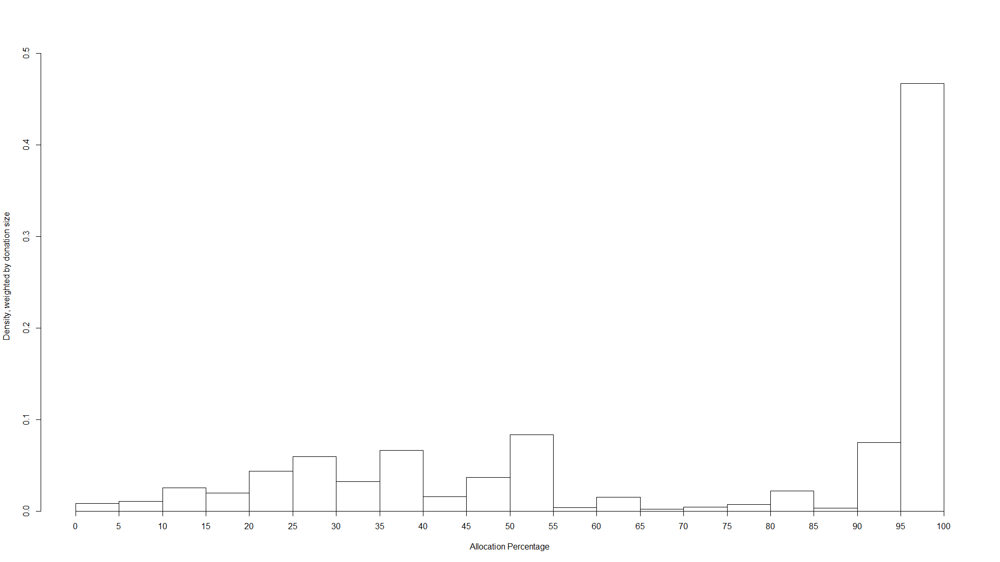
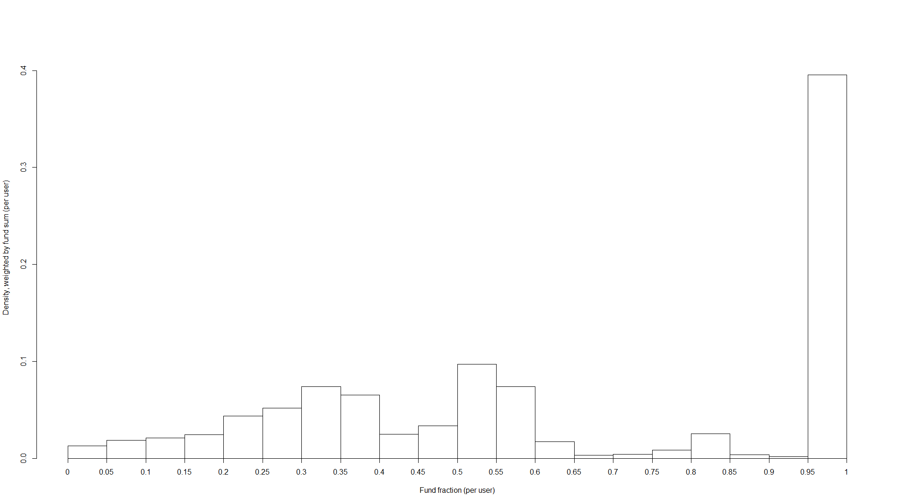

Cross-posted to the effective altruism [forum](http://effective-altruism.com/ea/1cx/how_much_donation_splitting_is_there_and_should/). 

# Table of contents
1. Will be replaced with the ToC, excluding the "Contents" header
{:toc}

# Summary
Many aspiring effective altruists report splitting their donations between two or more charities. I analyse EA funds data to estimate the extent of splitting. Expected utility reasoning suggests that for small donations, one should never split, and always donate all the money to the organisation with the highest expected cost-effectiveness. So prima facie we should not split. Are there any convincing reasons to split? I review 6 arguments in favour of splitting. I end with my recommendation.

# Many of us split
## Individual examples
For example, in [CEA Staff's Donation Decisions for 2016](https://www.centreforeffectivealtruism.org/blog/cea-staff-donation-decisions-2016/), out of 14 staff members who disclosed significant donations, I count 10 who report splitting. (When only small amounts are donated to secondary charities, it is sometimes ambiguous what counts as splitting.) In 2016, Peter Hurford [gave](http://peterhurford.com/other/donations.html) about 2/3 to Rethink Charity, and 1/3 to other recipients. Jeff Kaufman and Julia Wise [gave](https://www.jefftk.com/donations) about equal amounts to AMF and the EA Giving Group Fund.

## EA funds data
I wanted to study EAs' splitting behaviour more systematically, so I looked at anonymised data from the EA funds, with permission from CEA. 

In the following sections, I describe various possible analyses of the data. You can skip to "best approach: user totals" if you just want the bottom line. The R code I used is [in the appendix](#appendix-r-code).

I was given access to a list of every EA funds donation between 2017-03-23 and 2017-06-19. Data on allocation precentages was included. For example, if a donor went to the EA funds website and gave $1000, setting the split to 50% "global health and development" and 50% "long-term future", there would be two entries, each for $500 and with an allocation percentage of 50%. In the following, I call these two entries _EA funds donations_, and the $1000 an _EA funds allocation_. 

### Naive approach: distribution of allocation percentages
The simplest analysis is to look at a histogram of the "allocation percentage" variable. The result looks like this[^data1]:

[^data1]: 
    The underlying data are:

    allocation percentage bucket	|	probability
    --- | ---
    5%	|	0.088
    10%	|	0.137
    15%	|	0.105
    20%	|	0.166
    25%	|	0.098
    30%	|	0.050
    35%	|	0.037
    40%	|	0.039
    45%	|	0.067
    50%	|	0.061
    55%	|	0.011
    60%	|	0.016
    65%	|	0.005
    70%	|	0.011
    75%	|	0.006
    80%	|	0.019
    85%	|	0.004
    90%	|	0.007
    95%	|	0.002
    100%	|	0.069

Here, most of the probability mass is on the left, because most donations are strongly split. But what we really care about is how much of the money being donated is split. For that we need to weight by donation size.

### Less naive apprach: weighted distribution of allocation percentages
I compute a histogram of allocation percentages weighted by donation size. In other words, I ask: "if I pick a random dollar flowing through EA funds, what is its probability of being part of an EA funds donation which itself represents X% of an EA funds allocation?", and then plot this for 20 buckets of Xs[^data2].

[^data2]: 
    The data:

    allocation percentage bucket	|	probability
    --- | ---
    5%	|	0.009
    10%	|	0.011
    15%	|	0.025
    20%	|	0.020
    25%	|	0.043
    30%	|	0.060
    35%	|	0.032
    40%	|	0.066
    45%	|	0.015
    50%	|	0.037
    55%	|	0.083
    60%	|	0.004
    65%	|	0.015
    70%	|	0.002
    75%	|	0.004
    80%	|	0.007
    85%	|	0.022
    90%	|	0.003
    95%	|	0.075
    100%	|	0.467

Here, much more of the probability mass is on the right hand side. This means larger donors split less, and are much more likely to set the allocation percentage to 100%.

But this approach might still be problematic, because it is not invariant to how donors decide to spread their donations across allocations. For instance, suppose we have the following:

| Allocation ID | Name  | Fund   | Allocation % | Donation amount |
| ------------- | ----- | ------ | ------------ | --------------- |
| 2             | Alice | Future | 100%         | $1000           |
| 1             | Alice | Health | 100%         | $1000           |
| 3             | Bob   | Health | 50%          | $1000           |
| 3             | Bob   | Future | 50%          | $1000           |

Here, Alice and Bob both split their $2000 donations equally between two funds. They merely used the website interface differently: Alice by creating two separate 100% allocations (perhaps the next month), and Bob by creating just one allocation but setting the sliders for each of the funds to 50%.

However, if we used this approach, we would count Alice as not splitting at all. 

It's an open question how much time should elapse between two donations to different charities until it is no longer considered splitting, but rather changing one's mind. In the individual examples I gave above, I took one month, which seems like a clear case of splitting. Up to a year seems reasonable to me. Since we have less than a year of EA funds data, it's plausible to consider any donations made to more than one fund as splitting. This is the approach I take in the next section.

### Best approach: user totals
For each user, I compute:
* Their fund sum, i.e. for each fund they donated to, the sum of their donations to that fund
* Their user totals, i.e. the sum of all their donations to EA Funds

This allows me to create a histogram of the fraction of a user total represented by each fund sum, weighted by the fund sum[^data3].

[^data3]: 
    The data are:

    fraction of user total bucket	|	probability
    --- | ---
    5%	|	0.013
    10%	|	0.019
    15%	|	0.021
    20%	|	0.024
    25%	|	0.044
    30%	|	0.052
    35%	|	0.074
    40%	|	0.065
    45%	|	0.025
    50%	|	0.033
    55%	|	0.097
    60%	|	0.074
    65%	|	0.017
    70%	|	0.003
    75%	|	0.004
    80%	|	0.008
    85%	|	0.025
    90%	|	0.003
    95%	|	0.002
    100%	|	0.395

This is reasonably similar to the weighted distribution of allocation percentages, but with a bit more splitting.

## Other data
One could also look at the [Donations recorded for Vipul Naik](https://donations.vipulnaik.com/) database, or Giving What We Can's data, and conduct similar analyses. The additional value of this over the EA funds analysis seemed limited, so I didn't do it. 

# Arguments for splitting
## Empirical uncertainty combined with risk aversion
Sometimes being (very) uncertain about which donation opportunity is best is presented as an argument for splitting. For example, the [EA funds FAQ](https://app.effectivealtruism.org/funds/faq) says that "there are a number of circumstances where choosing to allocate your donation to multiple Funds might make more sense" such as "if you are more uncertain about which ways of doing good will actually be most effective (you think that the Long-Term Future is most important, but you think that it's going to be really difficult to make progress in that area)".

High uncertainty is only a reason to split or diversify if one is [risk averse](https://en.wikipedia.org/wiki/Risk_aversion). Is it sensible to be risk averse about one's altruistic decisions? No. As Carl Schulman [writes](https://80000hours.org/2012/01/salary-or-startup-how-do-gooders-can-gain-more-from-risky-careers/):

> **What am I going to do with my tenth vaccine? Vaccinate another kid!**
>
> While Sam’s 10th pair of shoes does him little additional good, a tenth donation can vaccinate a tenth child, or a pay for the work of a tenth scientist doing high impact research such as vaccine development. So long as Sam’s donations don’t become huge relative to the cause he is working on (using up the most efficient donation opportunities) he can often treat a charitable donation of $1,000 as just as worthwhile as a 1 in 10 chance of a $10,000 donation.

## Moral uncertainty
The EA funds FAQ says that another reason for splitting could be "If you are more uncertain about your values (for example, you think that Animal Welfare and the Long-Term Future are equally important causes)".

Does it make any difference if the uncertainty posited is about morality or our values rather than the facts? In other words, is it reasonable for a risk-neutral donor facing moral uncertainty to split?

This depends on our general theory for dealing with cases of moral uncertainty. (Will MacAskill has written his [thesis](http://commonsenseatheism.com/wp-content/uploads/2014/03/MacAskill-Normative-Uncertainty.pdf) on this.) We can start by distinguising moral theories which value acts cardinally (like utilitarianism) from moral theories which only value acts ordinally. The latter category would include theories which only admit of two possible ranks, permissible and impermissible (like some deontlogical theories), as well as theories with finer-grained ranking.

If the only theories in which you have non-zero credence are cardinal theories, we can simply treat our normative uncertainty like empirical uncertainty, by computing the expected value. (MacAskill argues persuasively against competing proposals like 'my favourite theory', see Chapter 1).

What if you also hold some credence in merely ordinal theories? In that case, according to MacAskill, you should treat the situation as a voting problem. Each theory can "vote" by ranking your possible actions, and gets a number of votes that is proportional to your credence in that theory. 

The question is which [voting rule](https://en.wikipedia.org/wiki/Arrow%27s_impossibility_theorem) to use. Different voting rules have different properties. A simple property might be:

**Unanimity:** if all voters agree that X>Y, then the ouput of the voting rule must have X>Y.

Let's say we are comparing the following acts:
1. Donate $1000 to charity A
2. Donate $500 to charity A and $500 to charity B.

Unanimity implies that if all the first-order theories in which you have credence favour (1), then your decision after accounting for moral uncertainty will also favour (1). So provided our voting rule satisfies unanimity, moral uncertainty provides no additional reason to split. (In fact, a much weaker version of unanimity will usually do, if you have sufficiently low credence in pro-splitting moral theories.)

## Diminishing returns
A good reason to split would be if you face diminishing returns. At what margins do we begin to see returns diminish sufficiently to justify splitting? This depends on how much donation opportunities differ in cost-effectiveness. 

Suppose there are two charities, whose impact $$f$$$ and $$g$$ are monotone increasing with monotone decreasing first derivatives. Then you should start splitting at $$D$$ such that $$g'(0)>f'(D)$$. 

If you have $$X$$, you should donate $$X-A$$ to charity f and $$A$$ to charity g such that $$g'(A)=f'(X-A)$$. 

It's generally thought that for small (sub-six-figure) donors, $$A=0$$, that is, returns aren't diminishing noticeably compared to the difference in cost-effectiveness between charities.

However, many people believe that at the level of the EA community, there should be splitting. What does this imply in the above model?

Let's assume that the EA community moves $$X = $100 million$$ per year (including Good Ventures). Some people take the view that the best focus area is more than an [order of magnitude](https://concepts.effectivealtruism.org/concepts/variation-in-cost-effectiveness/) more cost-effective than others (although it's not always clear which margin this claim applies to). Under some such view, marginal returns would need to diminish by more than 10 times over the 0-100M range in order to get a significant amount of splitting. To me, this seems intuitively unlikely. (Of course, some areas may have much faster diminishing returns than others[^exemp].) Michael Dickens [writes](http://effective-altruism.com/ea/wr/how_should_a_large_donor_prioritize_cause_areas/#diminishing-utility-over-large-amounts-of-money):

> The US government spends about $6 billion annually on biosecurity5. According to a Future of Humanity Institute survey, the median respondent believed that superintelligent AI was more than twice as likely to cause complete extinction as pandemics, which suggests that, assuming AI safety isn’t a much simpler problem than biosecurity, it would be appropriate for both fields to receive a similar amount of funding. (Sam Altman, head of Y Combinator, said in a Business Insider interview, “If I were Barack Obama, I would commit maybe $100 billion to R&D of AI safety initiatives.”) Currently, less than $10 million a year goes into AI safety research.
>
> Open Phil can afford to spend something like $200 million/year. Biosecurity and AI safety, Open Phil’s top two cause areas within global catastrophic risk, could likely absorb this much funding without experiencing much diminishing marginal utility of money. (AI safety might see diminishing marginal utility since it’s such a small field right now, but if it were receiving something like $1 billion/year, that would presumably make marginal dollars in AI safety “only” as useful as marginal dollars in biosecurity.)
>
> To take another approach, let’s look at animal advocacy. Extrapolating from Open Phil’s estimates, its grants on cage-free campaigns are probably about ten thousand times more cost-effective than GiveDirectly (if you don’t heavily discount non-human animals, which you shouldn’t) (more on this later), and perhaps a hundred times better after adjusting for robustness. Since grants on criminal justice reform are not significantly more robust than grants on cage-free campaigns, the robustness adjustments look similar for each, so it’s fair to compare their cost-effectiveness estimates rather than their posteriors.
>
> Open Phil’s estimate for PSPP suggests that cage-free campaigns are a thousand times more effective. If we poured way more money into animal advocacy, we’d see diminishing returns as the top interventions became more crowded, and then less strong interventions became more crowded. But for animal advocacy grants to look worse than grants in criminal justice, marginal utility would have to diminish by a factor of 1000. I don’t know what the marginal utility curve looks like, but it’s implausible that we would hit that level of diminished returns before increasing funding in the entire field of farm animal advocacy by a factor of 10 at least. If I’m right about that, that means we should be putting $100 million a year into animal advocacy before we start making grants on criminal justice reform.

I find this line of argument moderately convincing. Therefore, my guess is that people who believe that their preferred focus area is orders of magnitude better than others, should generally also believe that the whole EA community should donate only to that focus area.

[^exemp]: One extreme example would be a disease eradication programme, where returns stay high until they go to zero after eradicaiton has been successful, vs. cash transfers where returns diminish very slowly. 

## Achieving a community-wide split
Suppose you do think, for reasons like those described in the previous section, that because of diminishing returns, the community's split should be $$A=30%X$$. (There may be other reasons to believe this, for instance if the impact of different causes is [multiplicative rather than additive](http://measuringshadowsblog.blogspot.fr/2015/08/multiplicative-factors-in-games-and.html).)

There are two ways that this could lead to you prefer splitting your individual donation: cooperation with other donors, and lack of information.

### Cooperation with other donors
Suppose that at time t, before you donate, the communty splits $$A_t = 50%X$$. You are trying to move the final allocation to $$A= 30%X$$, so you should donate everything to $$f$$ (assuming your donation is small relative to the community). If the community's allocation was $$A_t = 90%X$$, however, you should donate everything to $$g$$. We can call this view the _single-player perspective_. 

From this perspective, it's very important to find out what the community's current allocation is, since this completely changes how you should act.

But now suppose that there other donors, who also use the single-player perspective. For the sake of simplicity we can assume they also believe the correct community-wide split is $$A= 30%X$$[^extension]. The following problem occurs:

> Everyone is encouraged to spend a lot of time looking into current margins, to work out what the best cause is. Worse, if the community as a whole is being close to efficient in allocation, in fact what is best at the margin changes a whole lot as things scale up, and probably isn’t much better than second- or third-best thing. This means that it’s potentially lots of work to form a stable view on where to give, and it doesn’t even matter that much.[^owen]

[^owen]: Adapted from Owen Cotton-Barratt, personal communication.

[^extension]: The extension to the general case would go like this: everyone truthfully states their preferred split and donation amount, and a weighted average is used to compute the resulting community-preferred spit. See also ["Donor coordination under simplifying assumptions"](http://effective-altruism.com/ea/13x/donor_coordination_under_simplifying_assumptions/).

Imagine the donors could all agree to donate in the same proportional split as the optimal community allocation (call this the _cooperative perspective_). They would obtain the same end result of a 70%/30% split, while saving a lot of effort. When everyone uses the single-player perspective, the group is burning a lot of resources on a zero-sum game.

From a rule-consequentialist perspective, you should cooperate in prisonner's dilemmas, that is, you should use the cooperative perspective, even if, to the best of you knowledge, this will lead to less impact.

Even if we find rule-consequentialism unconvincing, act-consequentialism would still recommend investing resources to make it more likely that the community as a whole cooperates. This could include publicly advocating for the cooperative perspective, or getting a group of high-profile EA donors to promise to cooperate amongst themselves.

### Lack of information
Suppose information about the community's split was impossible or prohibitively expensive to come by. Then someone using the single-player perspective would have to rely on their priors. One reasonable-sounding prior would be one that is symmetrical on either side of $$A_t=30%X$$, or otherwise has the expected value $$A_t=30%X$$. This prior assumes that given no information about where others are donating, they are equally likely to collectively undershoot as to overshoot their preferred community-wide split. 

On this prior, the best thing you can do is to donate 70% to $$f$$ and 30% to $$g$$. So given some priors, and when there is no information about others' donations, the single-player perspective converges with the cooperative perspective. 

## Remaining open-minded or avoiding confirmation bias
Because of confirmation bias and consistency effects, donating 100% to one charity may bias us in the direction of believing that this charity is more cost-effective. For example, one GiveWell staff member [writes](http://blog.givewell.org/2015/12/09/staff-members-personal-donations-for-giving-season-2015/)[^more]: 

> I believe that it is important to keep an open mind about how to give to help others as much as possible. Since I spend a huge portion of my time thinking within the GiveWell framework, I want to set aside some of my time and money for exploring opportunities that I might be missing. I am not yet sure where I’ll give these funds, but I’m currently leaning toward giving to a charity focused on improving farm animal welfare.

[^more]: In addition, this OpenPhil [post](http://www.openphilanthropy.org/blog/worldview-diversification) on worldview diversification, and this [comment](http://effective-altruism.com/ea/wr/how_should_a_large_donor_prioritize_cause_areas/7c7) give reasons a large funder may want to make diversified donations in order to retain the ability to pivot to a better area. Some of them may transfer to the individual donor case.

I tend to find this type of argument from bias less convincing than other members of the EA community[^also]. I suspect that the biases involved are insensitive to the scope of the donations, that is, it's sufficient to donate a nomial amount to other causes in order to reduce or eliminate the bias. Then such considerations would offer no reason for significant splitting. It's also questionable whether such self-deception is even [likely to work](http://lesswrong.com/lw/je/doublethink_choosing_to_be_biased/). Claire Zabel's post ["How we can make it easier to change your mind about cause areas"](http://effective-altruism.com/ea/m3/how_we_can_make_it_easier_to_change_your_mind/) also offers five techniques for reducing this bias. Applying these techniques seems like a less costly approach than sacrificing significant expected impact to splitting.

[^also]: The points in this paragraph apply similarly to oher "arguments from bias", such as donating for learning value or to motivate oneself to do reasearch in the future (both of which I have seen made). 

## Memetic effects
Sometimes people justify splitting like so: "splitting will reduce my direct impact, but it will allow me to have more indirect impact by affecting how others view me".

For [example](http://effective-altruism.com/ea/14u/eas_write_about_where_they_give/):
> In the past we've split our donations approximately 50% to GiveWell-recommended charities and 50% to other promising opportunities, mostly in EA movement building. [...] GiveWell charities are easier to talk about and arguably allow us to send a less ambiguous signal to outsiders.

And [also](https://www.centreforeffectivealtruism.org/blog/cea-staff-donation-decisions-2016/): 
> I’ll probably also give a nominal amount to a range of different causes within EA (likely AMF, GFI and MIRI), in order to keep up to date with the research across the established cause areas, and signal that I think that other cause areas are worthwhile.

The soundness of these reasons depends very much on each donor's personal social circumstances, so it's hard to evaluate any specific instance. A few general points to keep in mind are:
* There may be memetic costs as well as benefits to splitting. For example, donating to only one charity reinforces the important message that EAs try to maximise expected value.
* From a rule-consequentialist perspective, it may be better to always be fully transparent, and not to make donations decisions based on how they will affect what others think of us.
* There could be cheaper ways of achieving the same benefits. For example, saying "This year I donated 100% to X, but in the past I've donated to Z and Y" or "Many of my friends in the community donate to Z and Y" could send some of the intended signals without requiring any actual splitting.

# Recommendation
I'm not convinced by most of the reasons people give for splitting. Cooperation with donors appears to me to be the best proposed reason for splitting. 

To some degree, we may be using splitting to satisfy our urge to [purchase "fuzzies"](http://lesswrong.com/lw/6z/purchase_fuzzies_and_utilons_separately/). I say this without negative judgement, I agree with Claire Zabel that we should "de-stigmatize talking about emotional attachment to causes". I think we should satisfy our various desires, like emotional satisfaction or positive impact, in the most efficient way possible. It may not be psychologically realistic to plan to stop splitting altogether. Instead, one could give as much as possible to the recipient with the highest expected value, while satisfying the desire to split with the small remaining part. Personally, I donate 90% to the Far Future EA fund and 10% to the Animal Welfare fund for this reason. 

# Appendix: R code

library(readr)
library(plotrix)
library(plyr)

f <- data.frame(read_csv("~/split/Anonomized EA Funds donation spreadsheet - Amount given by fund.csv"))

exchr <- 1.27

# convert everything to usd
f$dusd <- ifelse(f$Currency=="GBP",exchr*f$Donation.amount,f$Donation.amount)

#naive histogram of allocation percentages
bseq=seq(0,100,5)
n <- hist(f$Allocation.percentage, breaks=bseq, freq=FALSE, xlab="Allocation Percentage", main="")
n_n <- data.frame(bucket=w$breaks[2:length(n$breaks)],prob=(n$counts/sum(n$counts)))

# weighted histogram
bseq=seq(0,100,5)
w <- weighted.hist(f$Allocation.percentage,f$dusd,breaks=bseq,freq = FALSE, xlab="Allocation Percentage", ylab = "Density, weighted by donation size")
w_n <- data.frame(bucket=w$breaks[2:length(w$breaks)],prob=(w$counts/sum(w$counts)))

#user totals
f <- ddply(f,.(UserID),transform,usersum=sum(dusd))
u <- ddply(u,.(UserID),transform,usersum=sum(dusd))

#user totals by fund
f <- ddply(f,.(UserID, Fund.Name),transform,usersum_fund=sum(dusd))

# fundfrac
f$fundfrac <- f$usersum_fund/f$usersum

# remove appropriate duplicates
f$isdupl <- duplicated(f[,c(2,5)])
f2 <- subset(f, isdupl == FALSE)

# weighted histogram of fundfrac
z <- weighted.hist(f2$fundfrac,f2$usersum_fund,breaks=bseq/100,freq = FALSE, xlab="Fund fraction (per user)", ylab = "Density, weighted by fund sum (per user)")
z_n <- data.frame(bucket=z$breaks[2:length(z$breaks)],prob=(z$counts/sum(z$counts)))


---
