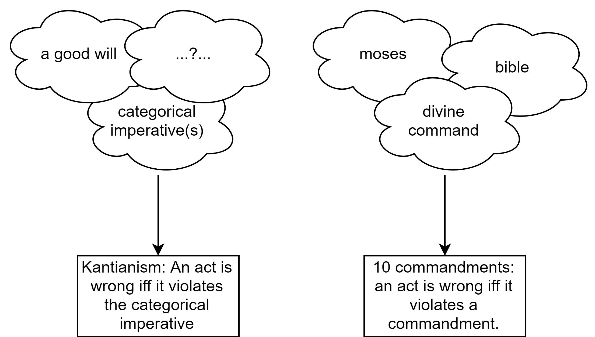

This diagram illustrates some popular theories of normative ethics, with a particular focus on consequentialist theories and their internal structure. 

<div class="mxgraph" style="max-width:100%;border:1px solid transparent;" data-mxgraph="{&quot;highlight&quot;:&quot;#0000ff&quot;,&quot;nav&quot;:true,&quot;resize&quot;:true,&quot;toolbar&quot;:&quot;zoom layers lightbox&quot;,&quot;edit&quot;:&quot;_blank&quot;,&quot;xml&quot;:&quot;&lt;mxfile userAgent=\&quot;Mozilla/5.0 (Windows NT 10.0; Win64; x64) AppleWebKit/537.36 (KHTML, like Gecko) Chrome/67.0.3396.87 Safari/537.36\&quot; version=\&quot;8.8.1\&quot; editor=\&quot;www.draw.io\&quot; type=\&quot;google\&quot;&gt;&lt;diagram id=\&quot;9f4ea972-c6cb-76b4-3124-c43bfe50a314\&quot; name=\&quot;Page-2\&quot;&gt;7V1tk5s4Ev41rtv94BQS7x8zSeZydbdVV7Vbl92PGiPb2mDkBTwv++tPEsgGCTBjIxscu1IZW4CAfrpbrVZ3a2Z/2rz+M0Xb9S80wvEMWtHrzP48gxDalsP+8Ja3sgU6btGySklUtIFDw6/kb1w2WmXrjkQ4q52YUxrnZFtvXNAkwYu81obSlL7UT1vSuH7XLVphreHXBYr11m8kytdFawC9Q/tXTFZreWfghcWRDZInl2+SrVFEXypN9peZ/SmlNC++bV4/4ZhTT9KluO6x5ej+wVKc5H0u8CKILODgp8gLYQiW87KHZxTvypctHzR/k2+f0l0SYd6BNbMfXtYkx79u0YIffWGAs7Z1vonZL8C+7l+Qn5vlKf2OP9GYpqIr2xIfdmRJ4li2JzRhfT2UD4LTHL+2vh3Y04xxG6YbnKdv7JTygjmwwpLQJasBu+zk5YCbG5Rt6wpmtl9ChkpeWe17P5CTfSkp2pO68Kao61rwKHF9v4m4gWWAuHYDcb0455TZooR9X/HvnymXQ5oi3tc2pVtGAsKUCVNHeIuTiH2hSfwm/hQqJMN/7XCy4ArnUfbIHq7aqYYiA2bLv7IbsAuzsSMZeB/cGpRzG4QalkBqrSqWngkoHQ3Kf6MkJygh2Uaj9RHKomxbjAFL8srl6rqkBn5dZubA9TRCBw10NiIyrkbn/5E0Z9+hhfM1WWQ3Ruxr0trTaIkjZlWUP2mar+mKJij+cmitUha/kvz3yvc/OE2Z1LJfCXu030sSix+HYwr5UZp/5PbPgcqi7ZHw1xDn/Inz/K20uNAup6zp8Gj/oXQr9VUrlMVr8neroZbRXbrAbXzoFyexh1nhvOUkpzf8KY5RTp7rD9AEZnnpfylhPR7Yxq0bDXMQKgxRvEx5mcIT++c4jU38O5ucxybuD8Emgaa5hWGzojRSrZYWy2bN8GWasLhPvuY6P2bE4OfTJb91EpFnEu1QnImOhfVzBTOHtT+Kz0C2jqMYrZZutALvUoZOqMHIAFmitMnOmdDMAACFyKF/RWtSug0qVGbvOr8FSsNgTHTWnQdfhZLJ1nQXR0Lb8HuuVileoRzXlEyhixgguDLNekr3Myz3YUu3O66whfYqzVP3c8OpE5+M2aA+rthWA6hBcClQdZ/FtzXiw+AGfS9GiwT/IxOjxxIXIwW0nnCWt+HIxhqaksNAw4eg+RMmyeom4VR1YROcUJ5jHk57GPuytClLCxPU7MuDufmHJPo07Muwh3kpkRrSvjwdTeeO5nlo9pfnC6Cpu2MSege4FeCgD8DWmAD2NIDfsO5juyP8HoTDMQHsawBvcZqxyQZaLvEi5zbOpD2qc0dZ83HAFV2qQPeC5DRH8eRXCdgcYExk1r0Ui5TkZCFmbTF+5uv7kyY3hCMiN9TdFZTNmVLeRPDL5NdkAoXU+nTocqQGGjFxEilDYYSytXAGgY5p5ZIm+SPakJi/1lccP2MuH+WBctwEoPzdRG2mtVYJa1swOjKs9RG4Hajj9kKXKdBuQJwyYku91TlkQwNGWbOPfu7YyuxbriHIPooHNeKjl0rlbtp1zLy6rXd/RMYdNOY6uSnIgjFBdvePnAvnmKZXUHeQsJGZTj8qaB5CJQDrumaR7qeIcEZS7t5f7mL2b4PL4XK6JB8XxXXHAX36k3sMnouF+Wzi5A78UZFbdxzc1BRLmc1aV6R0eB+Bz5wsGQhoOj3G2rrDeSac3pjgbPB/3OF8F5xjmqFKX8fdnTWYO6vPHMm2h+eBFneWOrTbvuLOagk5bXCMQaUn73KOMVtP1bkh82vuhIr9dc3VBFvPpRlKSXSIsBRQUBPPvUjuw9DrEepHBf8UEYZ9FpHd/mq8mjnYAKJsOze4XDpe9glZ3mmCfjxK3aSg6w6bj6+EMczqTWNCJnB5ndlSnJG/0ZM4gXPLlj+ieGj3gYcKMsFnxkBWjkaVQSfGS94Vl2K+SPmxbM65ocCTARckWf0mrIa5M5TMB/XpLXD1sPKmqHJoROZ1/823NVmsuezwNpREPPqS8P/eGB/NRAIAFS+EnuiuCN20bi8Wc5+iLVGSiefVWEzJtFWYHBMwhd25Pjh+oi81s4c3sAOSrzspewmrumoMHksxalHdGnhHtLndJwUodMxYXwGs69JAHbFbVCkDAr1VTisVWfuNfK9+I9+F3dacbykX+K7CmsUzDKfZdYclWuRTt9wC3/8AA9cHTvl/jajQvqYdp7ss013cED04LYr7ARwtxfWwpw3NixS5SdOcvd9YaS7H2QrNM9Yta5ETxGz3lGGu+kTuSMWcmTYk1ngh0bO6HsQ8qMgCivCCZEVOFtdH/O5inbBqaC5ilGVkSRihecpXzjOEUvHY8BPvKaU8LpZ/pRziBBMBtsgfQhuOXPKUbW/A/gQwDJV1sObsrgZwfSMmaKCR9AwTtM3+g1fKMVft09kwNqiUzm4b1G1mhffZoO+3HBUT1S8X4NotR/edpmbgKEawbSksOLCpKcldHYfRK9kwtTP5cHoAoaoQHKB7Di6n7HXPbMbYNVuSxQ0Q27bHRWzdNcuNnXwtSG3hOMNTp7hj63Ef16S42znc3X4IpzTmugvtwN5AGx7NALQ0eylUKhpq14DgyDUGhqiBijvd5Dp6P54ztYZ6GZ5rsOuN85zugdOZ0NjCnsKO7Uzcb0X/JL5y+vBV/0HrMgt7bEwEGq94Sje9V/GB7WmdAaWzoZzSwG4I4gTHnk+7pocwHRNAA8LUPQ/+sRW49D51B8GMKRDKuUedngvnmNJ4pOq9w3kynGNK45GhET+u5WL1gax/oPCFLBfpGtyP/uGJMUlzX60i4Sg9GYxJki9RLZ2prmEozDjt0CTguKo9BZx+Thgj0Umu7mMUtUuL4oDi2jUSaU9FVdIMiQXAXZyTTVE1UJZvR2RzraqkQzrJXK36OnCvWX3d1f2SaMXeZr5XIJUKszlprrcynRqa81Cjv3dV8utBkwX5E7zLBeOrYXk6GNZPwpNMNqLMIjvvrx1tPlMe+XnKCDIqjgtCPQDzlgQGSA3xtqf/Vamte8J4fd9bojgEKn9fmeR6NNq9kl3nLG123OJ3x5QaKC2QixSjvCUQx+QH8+6Ok47dJPo4TlwD61Knw6k7Tgxq3anA2Esqx5RE7+keiHud37MRNrA90OkI6y4OlGQvIoA5X2Me12MxyzTjmxlk+nyOJowWx5OvpivnFaaEGleexCJuDxbx+g/N0u5m1LJDJRNTFl0/eyFYydlRc8xafKCHjuSJdLkUIfHD+km9wWqn+TfJcX2iD97BcWfnpp3ETO8OAvCa7mJsWd7TXWFNe3oe160zdb9OXbnq3S5FNgJGInFWuOD6bv950oKBWjFDXSPYkCgSQhajJxw/oMX3lfBgVNh9KT5dPodyS+TySWZ7D3+VQ1tUQZeWhI4cpGXExjA60tXcHna9D0O6T/ffnacMr6vxOoqkQHXF8xRd6PVJyjUQUNDCNOqez7KC1tC6ULmP1x3XZAcdZxtQnT3CAyfkAFVo3ZSjD0w4Oj3d0Tk9TWBG2i9v1LjWB1D5WMHp8QfKvnnOKFSE9lzGlYTu5L0l7u4aAls4f6hg4oHHMEfpoTeny+y8w3anhiYGKqcfCwyGVthxwfCsLtNnq6WIsoxZ1kUp4yKdXBzkK+Y/LVAaEcaCP3Oe4NEp7ZnmA46i/CM2ujWVZh7UF25d1/mgV8CxpYPS+DKif68/2VG4rIdG8humb1fzesrahBUR+01EcCU03cjAIbrLt7u9wKGZFkqUzw7VqBp2D30sJuWvaLPlkXq8aMC+cMDHRT7/1LKJ6CVbzCmIx0fDdSiUMmaeFPuaenB09QBsI/pB96ObpK75dFhfzYbZ061G4FAnsB0YEdn7BhntClgq124NDMekgY3lN98CnH2WEU3AeZpBDWBYd6l69hGb2rU6LzBgU+tu0n9x67l0mUuTWZrQTyLAWxjdohIQ2l8KrYikeJHHb5UyQM+En4ASWflp390NhHxbSoE/4OgVnoBcRTZvhncXovzB1UafMKFgVHa47rNkcvFMIlwK3QZtt0WNkWVKNw2Sevg9bTkLw/p6pW3rs10gfW7mxUz3thVqTyPzxKq8WH5dm0FZQaRCZr9Bmfm2ASoHuqOHJDdB59APlNnDdQl9d9507Fzea+4wpiTrQPfeFBV9jxtvhaXWXI52QtPzMNTrWzSYZRdLsgiMbTh6AwLWyyyTI+44BOzua+mAs88uHVJFjQPOfrFpB9tDKMiGrLR+IWUT0qOeo+6taXsNdvfl9GhTNJeO1B0n6DTNjy6H02grmlX0beduFt0mYZ8Y9XeUUbpU1Q819ErdP6h/1I1SOdg2FaSsBj3YoeHdMII+UWKDc27JnUDjzhP2YenmXNhncO6fYnUhzg0UJ6vjnsq5AVB6MhVFc3nO7RMBNmGdO/As4VI1ItX1AVsth9y/QqSl8K6trtQPtmmRot4dz+1+NJXZXetYZUjLdrquGF48Qt2Z+MOJxztKAV7KJBlMOvzLCUd9bVYRDgOca8w7OxGPQp+A3lGFz8ldYyu65ktr0Om0S9K5gfWBzSu9IPRcF/iwrtX3W5ZWVzUuVZ0ubNovt5j68+1kaijI2ln8wLyg7Ed2AoDb18NB6SkoghMPXoSityt5EUQoIf/M2nbJORNgWZ28hNS39V2OwgZIjUQRhu2euvMgbY8GvTa+pSY2Aq1XH8n8hg09Gn1GZjawapq/DIFtb1HVNXEdIgmFjk7/jN8mBqmzUI1HjMAOVdihBrszjJJmP1PKwTjYQuyV17/QCPMz/g8=&lt;/diagram&gt;&lt;/mxfile&gt;&quot;}">

*Theories of normative ethics, and the structure of consequentialist theories*. Here's the same diagram as a [``.png``](../images/normative-ethics.png) and an [``.xml``](../files/normative-ethics.xml).

# Contents
{: .no_toc}
1. toc
{:toc} 

# What is consequentialism?
The term "consequentialism" has been used in many different senses. Of course, what matters are not the words, but to clearly distinguish different distinctions. What's important about the diagram above is how it carves up the space of possible theories, not what the theories are called. Let me just clarify how I use the terms.

[SEP](https://plato.stanford.edu/entries/consequentialism/) tells us that consequentialism is the view that moral rightness depends only on consequences. I'll take a slightly broader definition and say that consequentialism is the view that moral _properties_ depend only on consequences.

John Broome (1991, Chapter 1) calls this the distinction between teleological and non-teleological theories.[^broome-teleo]

[^broome-teleo]: Weighing Goods, p.3:
    > The idea is, then, that teleology insists acts are to be valued by
    their consequences alone, and that this is how it should be
    distinguished from other theories. This is the source of the term
    'consequentialism'. 'Consequentialism' is these days used more
    often than 'teleology', but it means the same, except that some
    authors narrow its meaning in a way I shall be explaining. I prefer
    the older term for two reasons that will soon appear. 

Broome proposes the following case to summarise the crux of the disagreement between consequentialism and non-consequentialism:

> [Suppose that] by breaking a promise now I can bring it about that I shall, in the future, keep five promises that otherwise I would have broken. Suppose, say, that if I break a promise now, the experience of guilt at my present tender age will stiffen my resolve in future life.

In this case, any theory that says I oguht to keep my current promise would have to be non-consequentialist.

Any consequentialist theory combines a _cardinal axiology_ and a _decision rule_ that depends only on this axiology in order to compare _evaluands_.

The issue of agent-neutrality vs agent-relativity is completely separate from that of consequentialism. There can be agent-relative consequentialist theories, and vice-versa. Agent-relative consequentialist theories will simply specify an axiology (and optionally also a decision rule and evaluands) for each agent. The Cambridge Dictionary of Philosophy says:

> A few versions of consequentialism are agent- relative: that is, they give each agent different aims, so that different agents’ aims may conflict. For instance, egoistic consequentialism holds that the moral rightness of an act for an agent depends solely on the goodness of its consequences for him or her. However, the vast majority of consequentialist theories have been agent-neutral (and consequentialism is often defined in a more restrictive way so that agentrelative versions do not count as consequentialist). A doctrine is agent-neutral when it gives to each agent the same ultimate aims, so that different agents’ aims cannot conflict.

## Axiology
An axiology is a ranking of states of affairs in terms of better and worse overall. A cardinal axiology assigns numerical values to states of affairs. The axiology used by a consequentialist theory must be cardinal in order to be able to apply expected utility theory when there is uncertainty.

An axiology is _welfarist_ if it's about what makes the life of persons (moral patients) go best. Non-welfarist axiologies might care about other features of states of affairs, like complexity or beauty in the universe, independently of what is good for any person. "Go best" is here intended to encompass a wide range of theories of _well-being_. Three common theories of well-being are the _hedonistic_, _desire fulfilment_, and _objective list_ theories discussed by Parfit (1984, Appendix i).

In a universe with more than one person, a welfarist also has to give an account of how to aggregate welfare across persons. This is _population ethics_. Again there are many different views of population ethics, I depict only three in the diagram. Totalism is the view that the value of a state of affairs is equal to the _sum_ (as opposed to, say, the average) of the welfare of all persons.

## Evaluands
An evaluand is anything that could make states of affairs better or worse. Evaluands could include acts, desires, dispositions, beliefs, emotions, the colour of our eyes, the climate, etc. 

The most widely discussed evaluands are acts. For instance, act-consequentialism is consequentialism applied only to acts. 

In almost all cases, an evaluand combined with an axiology in the following direct way. Within a set of mutually exclusive evaluands, each evaluand is given the cardinal value of the state of the world that would result if the evaluand were to obtain.

In theory it's also possible to assign a value to an evaluand indirectly. I only discuss this possibility because it has been the source of confusion. The name "rule consequentialism" has been applied to both a direct and an indirect theory. Direct rule-consequentialism is consequentialism applied only to rules, and has the same structure as act-consequentialism. Indirect rule-consequentilism assings values to acts according to the goodness of the state of affairs in which the rule obtains. For both theories, a bit of additional precisification is needed to explain what it means for a rule to "obtain". Does it mean that the rule is widely or universally followed? That people intend to follow it?

The result of combining an axiology with a set of evaluands is an assignment of values to evaluands, which is what the blue box depicts.

## Decision rule
A decision rule, for our purposes, is a procedure that classifies evaluands into right, wrong, or neither. The decision rule is what gives rise to a theory's normative pronouncements: its "ought" and "ought not"-statements (much more on this below). A _maximising decision rule_ says that the object which makes states of affairs best (according to some axiology) is right, and all others are wrong. An example of a non-maximising decision rule is _satisficing_: everything that makes states of affairs better than some threshold is right (or at least not wrong).

Combining consequentialism with a maximising decision rule gives theory C[^def]. theory C roughly says: "There is one ultimate moral aim: that outcomes be as good as possible" (Parfit p.24). More precisely, for any evaluand X, it says: "The right X is the X such that if it were to obtain, outcomes would be as good as possible. All others are wrong".

[^def]: Some, like Parfit, _define_ consequentialism as theory C. In other words, they bake a maximising decision rule into the definition of consequentialism. That is a merely verbal issue which need not distract us.

## What is utilitarianism?
Utilitarians claim that each of us ought to do whatever maximises everybody’s happiness. There are many ways to precisify this slogan, and hence many flavours of utilitarianism. The simplest one is hedonistic total utilitarianism. Hedonistic total utilitarianism is theory C combined with a hedonistic, totalist axiology. Hedonistic total act-utilitarianism is hedonistic total utilitarianism applied only to acts.

# Comparing consequentialist and non-consequentialist theories
## Older theories
Older theories of ethics, like, say, the ten commandments or Kantianism, were built entirely around a list of prohibitions. They are essentially _just_ a decision rule, and they only apply to acts. These decision rules pronounce some acts right (and mandatory), some wrong (and forbidden), and make no normative statements about the majority of acts, calling them neither right nor wrong, and permissible. They do not involve an axiology.

This is not to say that these decision rules are chosen by mere intuition (what Will MacAskill would call "[no-theory deontology](https://80000hours.org/2018/01/will-macaskill-moral-philosophy/)"). Philosophers (famously, Kant) have developed intricate justifications for their decision rules. But these justifications do not involve axiologies, or degrees of goodness which are then compressed down by a decision rule. 

*The structure of older theories*

## Theory C applied to acts vs the spirit of consequentialism
I must here make a point that may appear somewhat technical and pedantic. But it actually has some importance (especially if you're interested in understanding how academic philosophers talk about consequentialism).

Let's consider the intersection of theory C and act-consequentialism, or, equivalently, theory C applied only to acts. That is, let us consider a consequentialism that is maximising and applied only to acts. Call this theory Act-C. Act-C claims only that the unique right act is the act which would make outcomes as good as possible. It picks out just one mandatory act and makes all other acts impermissible.

The technical point is: Act-C has the same formal shape as these older theories. Of course, what is really of interest to consequentialists is something much richer than Act-C. It is richer in two ways. First, consequentialists care about all evaluands, not just acts; they see no reason to focus the particular subset Act-C of C. Second, what animates them is not even really C itself, but rather the assignment of cardinal values to evaluands (blue box), which, when combined with maximisation, produces theory C as its output.

On the first point: consequentialists have no particular hang-up about acts. They endorse the evaluation of all evaluands according to their consequences, and use whatever evaluand is appropriate. 

On the second point: the motivating idea of consequentialism is not to pick out one act as the right one. It's to assign cardinal values to acts (and to motives, dispositions, or anything else you might be able to affect) and to say: "that's how good it is!". That is what we find in the blue box. The move from the blue box to the red box is an act of lossy compression, throwing out almost all the information and retaining only a ternary[^bin] classification[^analogies]. That is why I call the red box only the "normative output" of consequentialism. It's what a consequentialist will say if forced to make "right/wrong"-statements.

In sum, Act-C is a doubly watered down of the real idea behind consequentialism.

[^bin]: In consequentialism, the resulting classification is actually just binary, since no acts are merely permissible.

[^analogies]: 
    It's as if you had a ``.docx`` file and needed to convert it to a ``.doc`` to run on your antiquated office computer, and all tables showed up as uneditable images. Another analogy: asking a consequentialist whether something is right or wrong is like a chimpanzee asking a Labour MP whether a Green MP is a glorious fellow tribesmember who must be protected no matter what, or a filthy outsider who should be killed at the earliest opportunity. It's shoehorning the nuance of modern politics into old categories. I am also reminded of the lottery and preface "paradoxes" in epistemology, about which I'll simply quote David Christensen (Putting Logic In Its Place, 2004, p. 97-98.): 
    > Kaplan, for example, considers a case in which you’ve just reported exactly how confident you are that a certain suspect committed a crime:
    > 
    >> One of your colleagues turns to you and says, “I know you’ve already told us how confident you are that the lawyer did it. But tell us, do you **believe** she did it?” (Kaplan 1996, 89) 
    >
    >  For Kaplan, there is something epistemically important left out when we give a description of a person’s degrees of confidence.
    >  or my own part, the colleague’s question feels a lot like the question “I know you’ve told us that the dog weighs 79 pounds and is 21 inches high at the shoulder. But tell us: is it big?"

## Why Act-C has received so much attention
What I've said is very obvious. Discussing the definition of Act-C as I did may seem rather like philosophic pedantry. I share that sentiment.

Yet Act-C has received most of the philosophical attention devoted to consequentialist theories.

The reason for this strange practice has to do with the order in which ethics has progressed. When consequentialist theories were first developed, they were discussed in terms of how they disagreed with the older theories. This affected the discussion in two ways. First, consequentialist theories were shoehorned into the ternary mould of the older theories, this de-emphasised their distinctive structure. Second, they were applied only to acts, like the older theories.

## Why it matters
I haven't delved into this pedantic distinction just because I'm interested in history of philosophy for its own sake. I think it can actually teach us something. Two common objections to consequentialism are (i) that it's too demanding and (ii) that it's self-defeating in a damaging way. The demandingness objection is narrowly targeted at theory C rather than at the spirit of consequentialism, so it is revealed to misconstrue that spirit. The self-defeat objection is aimed even more narrowly at those who (naively) would apply C only to acts rather than to everything. Hence both objections lose much of their force.

In a sense, the order in which ethics has developed has given an unfair incumbency advantage to the older theories. Those theories shaped the terms of the debate, allowing attention to be focused on strange, shoehorned versions of consequentialism, rather than letting consequentialism shine in its natural form.

### Demandingness
Theory C is sometimes said to be too demanding, constantly requiring us to do the _very best_ thing, lest we be hit with the moral opprobrium of the theory. To indulge in caricature: deontologists think of morality as a matter of whether or not the heavens will part and god will thunder down at you: "WRONG!". And it does seem a bit excessive to be thundered down at every time you don't do literally the most altruistic thing possible. 

But if we look at the blue box, we can see that this is not what consequentialists have in mind. It's more like: if you donate \$3000 to the Against Malaria Foundation, the heavens will part and god will say: "30 quality-adjusted life-years added in expectation"; if you donate \$6000, the heavens will part and god will say: "60 quality-adjusted life-years added in expectation", and so on.

Consequentialism needs to be thought of more like a general injunction to maximise good consequences, rather than a god who rains lightning on you if you don't attain the exact global maximum.[^railton] 

Some might find even that too demanding[^d]. But at least the basic form of the demandingness objection is deflected.

[^d]: 
    But they might have a hard time finding a plausible theory that is less demanding. In "[Global poverty and the demands of morality](https://www.fhi.ox.ac.uk/wp-content/uploads/Global-Poverty-and-the-Demands-of-Morality-1.pdf)", Ord writes:
    > The third variant was that the level of the demand is unintuitively high, and that morality cannot demand so much of us. However, many widely accepted moral principles demand more than this. For example, it wrong to kill the innocent. Suppose you are framed for murder in the United States, and are likely to be executed if brought to trial. The only way to escape is to kill the arresting officer, but since he is innocent, it is wrong to do so. Morality thus requires that you allow yourself to be executed in order to meet its demands. This is a much higher demand than that of donating much of your income, yet we (rightly) accept it. Similarly, it is wrong to keep slaves, and morality demanded that slave owners free their slaves even if it meant financial ruin. There are many similar cases in which morality demands a very high sacrifice and yet we find it acceptable. Most of these are extreme life-or-death cases, but so is global poverty

### Self-defeat, decision-making and motivation
Consequentialism is often said to be self-defeating in some damaging way. For example: making decisions by means of consequentialist calculation might lead to a sort of “alienation” between one’s affections and one’s deliberative self – one that in turn leads to a sense of loneliness and emptiness, and is destructive to valuable relationships. Hence even a consequentialist should not, by his own lights, desire that people make decisions by explicit appeal to consequentialist reasoning. Hence Bernard Williams writes “Utilitarianism’s fate is to usher itself from the scene” (‘A critique of utilitarianism’, p.134)[^greaves].

In part I of Reasons and Persons, Parfit painstakingly shows the mistakes in these objections. But the solution to the purported puzzle would have been more obvious, I claim, if the focus had been from the start on theory C rather than only on Act-C. Act-C may be viewed as a historical accident which led us into thickets of confusion. Theory C (Ord's 'global' consequentialism[^ordthesis]) is simpler and more general. It just says: "The right explicit moral reasoning is that which makes things best", "the right motive is that which makes things best", "the right act is that which makes things best", and so on.

These statements do not contradict each other. Hence there is nothing self-defeating about C when applied to decision-making and motivation. There is no logical contradiction. It is somewhat counter-intuitive that the act recommended by C may fail to coincide with the act that would be chosen given the decision procedure or character trait recommended by the same theory. But it actually fits perfectly with our picture of human psychology.

Theory C takes no view on the question of whether _homo sapiens_ are best thought of as "choosing" acts, policies, entire sets of motives, or something else. It's a topic for decision theory and psychology. It may have great practical importance, but in the realm of evaluating C, it is not relevant.

In this context, the self-defeat objection could be rephrased as: "Humans shouldn't be thought of as really _choosing_ acts. Rather, the proper evaluand of human moral theorising is motive or character." The consequentialist may well agree. She might reply: "this claim seems to have some truth to it, but is certainly not an objection to C. It's a claim about which parts of C are most useful for humans."

 <!-- hr to be added before footnotes-->  

[^ordthesis]: 
    The abstract of his thesis:
    > It is often said that there are three great traditions of normative ethics: consequentialism, deontology, and virtue ethics. Each is based around a compelling intuition about the nature of ethics: that what is ultimately important is that we produce the best possible outcome, that ethics is a system of rules which govern our behaviour, and that ethics is about living a life that instantiates the virtues, such as honesty, compassion and loyalty. This essay is about how best to interpret consequentialism. I show that if we take consequentialism beyond the assessment of acts, using a consequentialist criterion to assess decision making, motivation, and character, then the resulting theory can also capture many of the intuitions about systems of moral rules and excellences of character that lead people to deontology and virtue ethics. 
    > 
    > I begin by considering the argument that consequentialism is self-defeating because its adoption would produce bad outcomes. I take up the response offered by the classical utilitarians: when properly construed, consequentialism does not require us to make our decisions by a form of naïve calculation, or to be motivated purely by universal benevolence. Instead it requires us to use the decision procedure that will produce the best outcome and to have the motives that lead to the best outcome. I take this idea as my starting point, and spend the thesis developing it and considering its implications.

[^greaves]: I take this from Ethics lecture notes by Hilary Greaves.

[^railton]: This is very similar to Peter Railton's idea, who "abandons normative terms altogether in the consequentialist part of his theory, arguing that the consequentialist account of wrongness as suboptimality is too much at odds with the pre-philosophic conception of wrongness as truly unacceptable behaviour" (Ord p. 115). Railton "proposed a theory that he called valoric utilitarianism. This theory differs from act-utilitarianism in two ways. The first is that it is not directly concerned with either rightness or goodness. Instead, Railton defines an act to be more morally fortunate than another if it leads to the promotion of more non-moral value. To this, one could add a theory of rightness and goodness which need not be a maximising theory. The idea is that the combined theory might be able to make consequentialist-style judgments concerning the need for maximization (using the language of moral fortunateness), and yet reserve the everyday terms rightness, wrongness, blameworthiness to bear meanings closer to their commonsense use." (Ord p. 33)