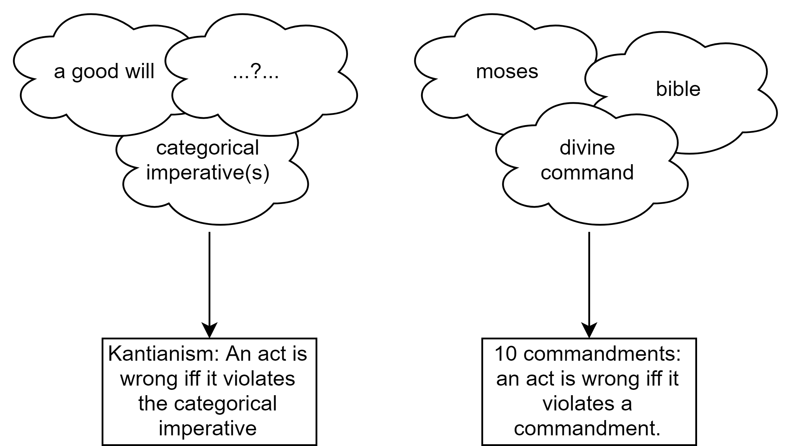

What is utilitarianism? Utilitarianism is an ethical theory. It states that each of us ought to do whatever maximises the sum of everybody's happiness. There are many ways to precisify this slogan, and hence many flavours of utilitarianism. The simplest one is hedonistic total utilitarianism. This diagram illustrates how someone who follows the blue lines at each decision node ends up endorsing hedonistic total utilitarianism.

*The structure of theories which involve axiologies*

# Contents
{: .no_toc}
1. toc
{:toc} 

# What is consequentialism?
Any consequentialist theory combines a _cardinal axiology_ and a _decision rule_ that depends only on this axiology. [SEP](https://plato.stanford.edu/entries/consequentialism/) tells us that consequentialism is the view that moral rightness depends only on consequences.

An axiology is a ranking of states of affairs in terms of better and worse overall. A cardinal axiology assigns numerical values to states of affairs. The axiology used by a consequentialist theory must be cardinal in order to be able to apply expected utility theory in cases of uncertainty.

A decision rule, for our purposes, is a procedure that classifies evaluands (such as possible acts in a certain situation) into right, wrong, or neither. The decision rule is what gives rise to a theory's normative pronouncements: its "ought" and "ought not"-statements (much more on this below). A maximising decision rule says that the object which makes states of affairs best (according to some axiology) is right, and all others are wrong. An example of a non-maximising decision rule is _satisficing_: everything that makes states of affairs better than some threshold is right.

Combining consequentialism with a _maximising decision rule_ gives theory C. Theory C roughly says: "There is one ultimate moral aim: that outcomes be as good as possible" (Parfit p.24). It applies to any thing X that might make outcomes better or worse. More precisely, for any X, it says: "The right X is the X such that if it were to obtain, outcomes would be as good as possible. All others are wrong".

# What is hedonistic total utilitarianism?
Hedonistic total utilitarianism is Theory C combined with a hedonistic, totalist axiology.

An axiology is _welfarist_ if it's about what makes the life of persons (moral patients) go best. Non-welfarist axiologies might care about other features of states of affairs, like complexity or beauty in the universe, independently of what is good for any person. "Go best" is here intended to encompass a wide range of theories of _self-interest_. Three common theories of self-interest are the _hedonistic_, _desire fulfilment_, and _objective list_ theories discussed by Parfit (1984, Appendix i).

In a universe with more than one person, a welfarist also has to give an account of how to aggregate welfare across persons. This is _population ethics_. Again there are many different views of population ethics, I depict only three in the diagram. Totalism is the view that the value of a state of affairs is equal to the _sum_ (as opposed to, say, the average) of the welfare of all persons.

This is a reasonably clear description of hedonistic total utilitarianism. If we modify the axiology in some ways, we obtain other versions of utilitarianism. I now discuss the meaning of the "normative output" box in the diagram.

# Comparing consequentialist and non-consequentialist theories
## Theory C vs the spirit of consequentialism
I must here make a point that may appear somewhat technical and pedantic. But it actually has some importance (especially if you're interested in understanding how academic philosophers talk about consequentialism). Theory C as I here understand it claims only that the unique right X is the X which would make outcomes as good as possible. It picks out just one mandatory X and makes all other Xs impermissible. 

Older theories of ethics, like, say, the ten commandments or Kantianism, were built entirely around a list of prohibitions. They are essentially _just_ a decision rule, and they only apply to acts. These decision rules pronounce some acts right (and mandatory), some wrong (and forbidden), and make no normative statements about the majority of acts, calling them neither right nor wrong, and permissible. They do not involve an axiology.

This is not to say that these decision rules are chosen by mere intuition (what Will MacAskill would call "[no-theory deontology](https://80000hours.org/2018/01/will-macaskill-moral-philosophy/)"). Philosophers (famously, Kant) have developed intricate justifications for their decision rules. But these justifications do not involve axiologies, or degrees of goodness which are then compressed down by a decision rule. 

*The structure of older theories*

The technical point is: theory C has the same formal shape as these older theories. Of course, what is really of interest to consequentialists is something much richer than theory C. What animates us is the algorithm which produces theory C as its output: develop an axiology, assign cardinal values (the red box), then use a maximising decision rule. While theory C is the orange box, the diagram as a whole represents the algorithm.

The motivating idea of consequentialism is not to pick out one act as the right one. It's to assign cardinal values to acts (and to motives, dispositions, or anything else you might be able to affect) and to say: "that's how good it is!". That is what we find in the red box. The move from the red box to theory C is an act of lossy compression, throwing out almost all the information and retaining only a ternary[^bin] classification.[^analogies] 

[^bin]: In consequentialism, the resulting classification is actually just binary, since no acts are merely permissible.

[^analogies]: 
    It's as if you had a ``.docx`` file and needed to convert it to a ``.doc`` to run on your antiquated office computer, and all tables showed up as uneditable images. Another analogy: asking a consequentialist whether something is right or wrong is like a chimpanzee asking a Labour MP whether a Green MP is a glorious fellow tribesmember who must be protected no matter what, or a filthy outsider who should be killed at the earliest opportunity. It's shoehorning the nuance of modern politics into old categories. I am also reminded of the lottery and preface "paradoxes" in epistemology[^warn], about which I'll simply quote David Christensen (Putting Logic In Its Place, 2004, p. 97-98.): 
    > Kaplan, for example, considers a case in which you’ve just reported exactly how confident you are that a certain suspect committed a crime:
    > 
    >> One of your colleagues turns to you and says, “I know you’ve already told us how confident you are that the lawyer did it. But tell us, do you **believe** she did it?” (Kaplan 1996, 89) 
    >
    >  For Kaplan, there is something epistemically important left out when we give a description of a person’s degrees of confidence.
    >  or my own part, the colleague’s question feels a lot like the question “I know you’ve told us that the dog weighs 79 pounds and is 21 inches high at the shoulder. But tell us: is it big?"

[^warn]: Warning: you'll only find this analogy funny or informative if you're already acquainted with that particular literature. Those who have been spared that experience are advised to skip to the next section.

That is why I call everything in the box only the "normative output" of consequentialism. It's what a consequentialist will say if forced to make "right/wrong"-statements. But a consequentialist would much rather speak in different terms altogether.

## Why theory C has received so much attention
What I've said is very obvious. Discussing the definition of theory C as I did may seem rather like philosophic pedantry. I share that sentiment.

Yet theory C has received most of the philosophical attention devoted to consequentialist theories[^def]. In fact, most of the ink has been spilled not even about theory C but about maximising act-consequentialism (green box), the part of C which applies to acts.

[^def]: Some, like Parfit, _define_ consequentialism as theory C. In other words, they bake a maximising decision rule into the definition of consequentialism. That is a merely verbal issue which need not distract us.

The reason for this strange practice has to do with the order in which ethics has progressed. When consequentialist theories were first developed, they were discussed in terms of how they disagreed with the older theories. This affected the discussion in two ways. First, consequentialist theories were shoehorned into the ternary mould of the older theories, this de-emphasised their distinctive structure. Second, they were applied only to acts, like the older theories.

## Why it matters
I haven't delved into this pedantic distinction (everyone knows what the god-damned "spirit" of consequentialism is!) just because I'm interested in history of philosophy for its own sake. I think it can actually teach us something. Two common objections to consequentialism are (i) that it's too demanding and (ii) that it's self-defeating. The demandingness objection is narrowly targeted at theory C rather than at the spirit of consequentialism, so it is revealed to misconstrue that spirit. The self-defeat objection is aimed even more narrowly at those who (naively) would apply C only to acts rather than to everything. Hence both objections lose much of their force.

In a sense, the order in which ethics has developed has given an unfair incumbency advantage to the older theories. Those theories shaped the terms of the debate, allowing attention to be focused on strange, shoehorned versions of consequentialism, rather than letting consequentialism shine in its natural form.

### Demandingness
Theory C is sometimes said to be too demanding, constantly requiring us to do the _very best_ thing, lest we be hit with the moral opprobrium of the theory. To indulge in caricature: deontologists think of morality as a matter of whether or not the heavens will part and god will thunder down at you: "WRONG!". And it does seem a bit excessive to be thundered down at every time you don't do literally the most altruistic thing possible. 

But if we look at the red box, we can see that this is not what consequentialists have in mind. It's more like: if you donate \$3000 to the Against Malaria Foundation, the heavens will part and god will say: "30 quality-adjusted life-years added in expectation"; if you donate \$6000, the heavens will part and god will say: "60 quality-adjusted life-years added in expectation", and so on.

Consequentialism needs to be thought of more like a general injunction to maximise good consequences, rather than a god who rains lightning on you if you don't attain the exact global maximum.[^railton] Some might find even that too demanding. But at least the basic form of the demandingness objection is deflected.

### Self-defeat, decision-making and motivation
Act-consequentialism is often said to be self-defeating in some damaging way. For example: Making decisions by means of consequentialist calculation might lead to a sort of “alienation” between one’s affections and one’s deliberative self – one that in turn leads to a sense of loneliness and emptiness, and is destructive to valuable relationships. Hence even a consequentialist should not, by his own lights, desire that people make decisions by explicit appeal to consequentialist reasoning. Hence Bernard Williams writes “Utilitarianism’s fate is to usher itself from the scene” (‘A critique of utilitarianism’, p.134)[^greaves].

In part I of Reasons and Persons, Parfit painstakingly shows the mistakes in these objections. But the solution to the purported puzzle would have been more obvious, I claim, if the focus had been from the start on theory C rather than only on act-consequentialism. Act-consequentialism may be viewed as a historical accident which led us into thickets of confusion. Theory C (Ord's 'global' consequentialism[^ordthesis]) is simpler and more general. It just says: "The right explicit moral reasoning is that which makes things best", "the right motive is that which makes things best", "the right act is that which makes things best", and so on. These statements do not contradict each other. Hence there is nothing self-defeating about consequentialism when applied to decision-making and motivation. A further question is whether _homo sapiens_ are best thought of as "choosing" acts, policies, entire sets of motives, or something else. It's a topic for decision theory and psychology. 

[^ordthesis]: 
    The abstract of his thesis:
    > It is often said that there are three great traditions of normative ethics: consequentialism, deontology, and virtue ethics. Each is based around a compelling intuition about the nature of ethics: that what is ultimately important is that we produce the best possible outcome, that ethics is a system of rules which govern our behaviour, and that ethics is about living a life that instantiates the virtues, such as honesty, compassion and loyalty. This essay is about how best to interpret consequentialism. I show that if we take consequentialism beyond the assessment of acts, using a consequentialist criterion to assess decision making, motivation, and character, then the resulting theory can also capture many of the intuitions about systems of moral rules and excellences of character that lead people to deontology and virtue ethics. 
    > 
    > I begin by considering the argument that consequentialism is self-defeating because its adoption would produce bad outcomes. I take up the response offered by the classical utilitarians: when properly construed, consequentialism does not require us to make our decisions by a form of naïve calculation, or to be motivated purely by universal benevolence. Instead it requires us to use the decision procedure that will produce the best outcome and to have the motives that lead to the best outcome. I take this idea as my starting point, and spend the thesis developing it and considering its implications.

[^greaves]: I take this from Ethics lecture notes by Hilary Greaves.

[^railton]: This is very similar to Peter Railton's idea, who "abandons normative terms altogether in the consequentialist part of his theory, arguing that the consequentialist account of wrongness as suboptimality is too much at odds with the pre-philosophic conception of wrongness as truly unacceptable behaviour" (Ord p. 115). Railton "proposed a theory that he called valoric utilitarianism. This theory differs from act-utilitarianism in two ways. The first is that it is not directly concerned with either rightness or goodness. Instead, Railton defines an act to be more morally fortunate than another if it leads to the promotion of more non-moral value. To this, one could add a theory of rightness and goodness which need not be a maximising theory. The idea is that the combined theory might be able to make consequentialist-style judgments concerning the need for maximization (using the language of moral fortunateness), and yet reserve the everyday terms rightness, wrongness, blameworthiness to bear meanings closer to their commonsense use." (Ord p. 33)

 <!-- hr to be added before footnotes-->  
