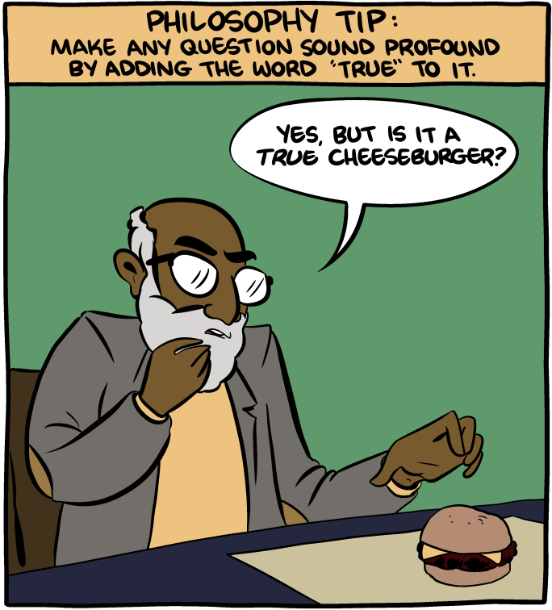

*Source: [SMBC](https://smbc-comics.com/index.php?id=4015)*

# Contents
{: .no_toc}
1. toc
{:toc} 

# Introduction

The point has been made often and well ([Wittgenstein](https://en.wikipedia.org/wiki/Family_resemblance), [Ramsey](https://link.springer.com/article/10.1007%2FBF00768299), [Muehlhauser](http://commonsenseatheism.com/?p=16103), [Yudkowsky](https://wiki.lesswrong.com/wiki/A_Human's_Guide_to_Words)), that conceptual analysis is doomed by resting on falsified assumptions about human cognition, and a mistaken view of the nature of empirical categories.

A first problem is with necessary and sufficient conditions:
> Category-membership for concepts in the human brain is not a yes/no affair, as the “necessary and sufficient conditions” approach of the classical view assumes. Instead, category membership is fuzzy. ([Muehlhauser](http://commonsenseatheism.com/?p=16103))

This first problem could be solved with a new type of conceptual analysis, one admitting of degree. However, a deeper problem arises from the requirement that an analysis admit of no intuitive counterexamples:
> [...] most of our empirical concepts are not delimited in all possible directions. Suppose I come across a being that looks like a man, speaks like a man, behaves like a man, and is only one span tall -- shall I say it is a man? Or what about the case of a person who is so old as to remember King Darius? Would you say he is an immortal? Is there anything like an exhaustive definition that finally and once for all sets our mind at rest? 'But are there not exact definitions at least in science?' Let's see. The notion of gold seems to be defined with absolute precision, say by the spectrum of gold with its characteristic lines. Now what would you say if a substance was discovered that looked like gold, satisfied all the chemical tests for gold, whilst it emitted a new sort of radiation? 'But such things do not happen.' Quite so; but they might happen, and that is enough to show that we can never exclude altogether the possibility of some unforeseen situation arising in which we shall have to modify our definition. ([Waismann](http://www.ditext.com/waismann/verifiability.html))

Waismann called this feature of our language _open texture_.

Clearly these two requirements must be abandoned (there go [entire literatures](https://plato.stanford.edu/entries/knowledge-analysis/)...). 

Is all conceptual analysis therefore useless? The view has some appeal. If all we want is to [dissolve](/le) philosophical confusions through clarification of ambiguities; this can be achieved by stipulating definitions that allow us to be as precise as we want, after which we can abandon other verbiage. Hence [SEP](https://plato.stanford.edu/entries/logic-classical/) tells us:
> Another view, held at least in part by Gottlob Frege and Wilhelm Leibniz, is that because natural languages are fraught with vagueness and ambiguity, they should be replaced by formal languages. A similar view, held by W. V. O. Quine (e.g., [1960], [1986]), is that a natural language should be regimented, cleaned up for serious scientific and metaphysical work. 

My view is the following: abandoning ambiguous terms in favour of more precise, stipulatively defined ones, i.e. regimentation, is always a legitimate philosophical move. Pragmatically, however, there are costs to doing so. Technical texts with a lot of jargon are difficult to read for a reason. It takes time to communicate the definitions of one's terms to others. And it takes longer still until our audience gains intuitive familiarity with the new terminology, and can manipulate it with speed and accuracy.

When deciding which words to use, we face a trade-off between precision on the one hand, and agreement with intuitive terminology on the other. 

Programming languages are an example of the fully regimented extreme. There is no ambiguity, but coding must be learnt the hard way. The language of small children or pre-scientific civilisations ("a whale is heavier than a bowling ball"), on the other hand, is completely intuitive.

The old view of conceptual analysis, requiring necessary and sufficient conditions, and admitting of no counter-examples, was an attempt to achieve both complete precision and complete intuitiveness. But from its failure it does not follow that all our old words should be regimented away. In some cases that may be the best we can do; some unsalvageable concepts, like what it means for a storm-cloud to be angry, are to be consigned to the dustbin of language. But for other terms, like "causation", it's not a foregone conclusion that the optimal way to navigate the trade-off is to abandon the word. We may do better to keep the word, along with its "good enough" definition. Conceptual analysis, on a more modest and fruitful view, is a tool that can help us to find such opportunities.

In general, therefore, I don't find conceptual analysis particularly exciting. If the use of regimented language dissolves a controversy of analysis, it's clear that nothing of "philosophical" importance was hanging in the balance in the first place. However, conceptual analyses can be pragmatically useful, and indeed there have been a number of examples I enjoyed. In what follows I list some intellectual phenomena I consider examples of conceptual analysis, and comment on them. 

# Examples
## Knowledge

The “analysis of knowledge merry-go-round" (Weatherson 2003), has rightly been much derided.

Here's a nice quote by [Scott Sturgeon](https://www.jstor.org/stable/pdf/3328464.pdf) (who used to be my tutor!):
>   Thirty years ago this journal published the most influential paper of >    modern analytic epistemology - Edmund Gettier's 'Is Justified True Belief >    Knowledge?'. In it Gettier refuted a classic theory of propositional knowledge by constructing thought experiments to test the theory. A cottage industry was born. Each response to Gettier was quickly met by a new Gettier-style case. In turn there would be a response to the case, a further Gettier scenario, and a reiteration of the process. The industry's output was staggering. Its literature became so complicated, its thought experiments so baroque, that commonsense was stretched beyond limit.

This is a clear example where regimentation is appropriate. Our epistemic state can be fully described by our beliefs and our evidence. What about "knowledge"? Commit it then to the flames! 

## Belief
Quoting from an essay I wrote in 2017:

> We want a theory of when it is rational to have an outright belief. It seems like we might easily get this from our theory of when it is rational to have a graded belief. Simply say, "it is rational to believe something simpliciter iff it is rational to believe it with a probability p>y." Let’s call this the threshold view. We won’t be able to put an exact number on y. This merely points to the fact that outright belief-language is somewhat vague. Similarly, in “a person is bald iff they have fewer than z hairs on their head”, z is imprecisely specified, but we still understand what it means to be bald, and we know that $$10<z<10^6$$.
> 
> 
But the cases of preface and lottery appear to show that the threshold view is false. 
>
> Consider the lottery: “Let the threshold y required for belief be any real number less than 1. For example, let y = 0.99. Now imagine a lottery with 100 tickets, and suppose it is rational for you to believe with full confidence that the lottery is fair and that as such there will be only one winning ticket. […] So, it is rational for you to have 0.99 confidence that ticket #1 will not win, 0.99 confidence that ticket #2 will not win, and so on for each of the other tickets. According to the [threshold view], it is rational for you to believe each of these propositions, since it is rational for you to have a degree of confidence in each that is sufficient for belief. But given that rational belief is closed under conjunction, it is also rational for you to believe that (ticket #1 will not win and ticket #2 will not win . . . and ticket #100 will not win)” (Foley 1992). However, this is a contradiction with your belief that the lottery is fair, i.e., that exactly one ticket will win the lottery. Thus y cannot be 0.99. The same conclusion can be reached for any probability y<1: simply create a lottery with 1/(1-y) tickets, and argue as before. Thus the threshold cannot be any less than 1. This clearly will not do, as it violates our intuitions about everyday uses of ‘believe’, as in “I believe it will rain tomorrow”. 
> 
> Similarly, consider now the preface: “You write a book, say a history book. In it you make many claims, each of which you can adequately defend. In particular, suppose it is rational for you to have a degree of confidence x in each of these propositions, where x is sufficient for belief but less than l. Even so, you admit in the preface that you are not so naive as to think that your book contains no mistakes. You understand that any book as ambitious as yours is likely to contain at least a few errors. So, it is highly likely that at least one of the propositions you assert in the book, you know not which, is false. Indeed, if you were to add appendices with propositions whose truth is independent of those you have defended previously, the chances of there being an error somewhere in your book becomes greater and greater. Nevertheless, given that rational belief is closed under conjunction, it cannot be rational for you to believe that your book contains any errors” (Foley 1992). Thus, if it is rational to believe each of the propositions that make up your book, then it is also rational to believe their conjunction, despite your having a low degree of confidence in that conjunction. Indeed, as before, your degree of confidence in the conjunction can be made arbitrarily low by adding more chapters to the book.
> 
> “After all, what reasons do we have to be interested in an [invariantist] theory of rational belief [simpliciter] if we have an adequate [invariantist] theory of rational degrees of belief? Does the former tell us anything useful above and beyond the latter? Is it really needed for anything? It doesn't seem to be needed for the theory of rational decision making.” (Foley 1992). The fact that our ordinary-language usage of ‘belief’ cannot fully account for the laws of probability is simply a kink of ordinary language. Ordinarily, we do not speak about things like very long conjunctions concerning lottery tickets. The shorthand word ‘belief’ deals well with most cases we do ordinarily encounter. In other cases, we can simply retreat to using the language of degrees of belief. 

Yeah, we don't need to conceptually analyse 'belief'. It's probably outright harfum to keep using that word. 

## Species
Humans have long understood that animals come in relatively sharply delineated clusters. By using a word for, say, "pig" and another for "dog", we are making use of these categories. More recently, modern biology has developed the concept of "species". Wikipedia explains that "a species is often defined as the largest group of organisms in which two individuals can produce fertile offspring, typically by sexual reproduction".

This definition can be viewed as a proposed conceptual analysis of our pre-scientific, or [folk-biological](https://en.wikipedia.org/wiki/Folk_biology), concept of "type of animal".

This analysis does really well, on hundreds of folk biological categories! We are so used now to the concept of species that this remarkable fact may appear obvious. There are some problem cases, too: [Elephants](https://en.wikipedia.org/wiki/Elephant) are three species; while a caterpillar and a butterfly can be the same species.

What is more, even the more regimented concept of species is too imprecise for some use cases. Wikipedia says: "For example, with hybridisation, in a species complex of hundreds of similar microspecies, or in a ring species, the boundaries between closely related species become unclear."

## Temperature
The definition of temperature as mean molecular kinetic energy can be viewed as a conceptual analysis. Wikipedia says that temperature is "a physical quantity expressing the subjective perceptions of hot and cold". And by and large it does excellently. However, it fails with spicy ("hot") food.

Does this exception mean we need to regiment away common-sense notions of hot and cold? No! This illustrates how analysis that admit of exceptions can still be useful.

## Speed and acceleration
Heisenberg:
> The concepts of classical physics are just a refinement of the concepts of daily life and are an essential part of the language which forms the basis of all natural science. 

Speed is the first derivative of location with respect to time, and acceleration is the second derivative.

This is a conceptual analysis so successful that the definition resulting from the analysis has replaced, in most adult speakers, the intuitive notion. (Something we have already seen to some extent with species). For this reason, it's hard to see that it was, in fact, a conceptual analysis.

Where can we find remnants of the pre-scientific, ur-intuitive notion of speed? The theories of Aristotle and small children seem like a good place to start in search of this pristine naiveté.

Per Macagno 1991, Aristotle had piecemeal correct intuitions about speed, but he did not see the more general point:

> Although Aristotle discusses in detail when a motion is faster than another
> by considering the space traversed and the corresponding time, he never arrived at what is so elementary for us: $$V = S/T$$. He considers several cases; for instance, in the case $$S_2=S_1$$, velocity $$V_2$$ is larger than $$V_1$$ if $$T_2 < T_1$$. To divide a distance by a time was not an acceptable operation, if it was considered at all [...]

Similarly, 11-year olds get time, distance, and speed right in most but not all cases ([Siegler and Richards 1979](http://www.psy.cmu.edu/~siegler/1979-Siegler-Richards.pdf)): 

> Children were shown
> two parallel train tracks with a locomotive
> on each of them. The two locomotives could
> start from the same or different points, could
> stop at the same or different points, and
> could go the same or different distances.
> They could start at the same or different
> times, could stop at the same or different
> times, and could travel for the same or different
> total time. Finally, they could go at
> the same or different speeds. [...]
>
> On the time concept, the state before full
> mastery seemed to be one in which time and
> distance were only partially differentiated.
> This was evident in the use of the distance
> rule to judge time by a large number of 11-
> year-olds. 

Similarly, I would expect (although citation needed) that many children who have a good grasp of the difference between position and speed (i.e. they would not say that whichever train ended farther ahead on the tracks travelled for the longer time, or the faster speed, or the greater distance), still do not clearly distinguish speed from acceleration. For instance, they might say: "whoa, the car went so fast just then - I was really pressed up against my seat."

Once we have conceptually analysed speed and acceleration as the first and second derivatives of position with respect to time, we have a powerful new formal tool. We can use this tool to create new concepts which did not exist in natural language. For example, the third time-derivative of position is jerk. Understanding jerk has many uses, for instance to build quadcopters and other drones.

Finally, here's an analogy from the opposite direction, taken from [Mori, Kojima and Tadang (1976)](https://onlinelibrary.wiley.com/doi/epdf/10.1002/sce.3730600413).

> Children are likely to judge the speed from temporal precedence and say, “It went faster because it arrived earlier.” In the Japanese language, the two words meaning fast  in speed and early in temporal precedence, respectively, have the same pronunciation, i.e., hayai. On  the  other hand,  in  the Thai language, these  two  words  are  differentiated  in  their pronunciation as well  as in meaning; the one that means high speed is re0 and the other one that means temporal precedence is khon. [...] 
> 
> 
> 
> The Japanese and Thai children were shown the same visual displays of moving objects and asked to compare the speed of those moving objects. The results significantly indicate that Thai children’s concept of speed is further advanced than that of Japanese children.

The Japanese children are to the Thai children like Aristotle is to a modern student armed with the formal notion of accelaration. It's possible to go beyond ordinary English with the formal language of physics, but it's also possible to lag behind ordinary English with (children's understanding of) Japanese. [Similarly](https://quotables.github.io/2018/01/15/batch-(6).html), "the Pirahã language and culture seem to lack not only the words but also the concepts for numbers, using instead less precise terms like “small size”, “large size” and “collection”."

## The epsilon-delta definition of a limit
See my [other post](\ps_predicate) on the success story of predicate logic.

## Effective calculability
See my [other post](/ps_computability) on the success story of computability.

## Causation
The conceptual analysis of causation fills many a textbook. Here I'll focus on just the counterfactual analyses, that is, analyses of causal claims in terms of counterfactual conditionals. 

A first attempt might be:
>Where c and e are two distinct actual events, c causes e if and only if, if c were not to occur e would not occur. 

But cases of _Preemption_ offer a counter-example (SEP):
> Suppose that two crack marksmen conspire to assassinate a hated dictator, agreeing that one or other will shoot the dictator on a public occasion. Acting side-by-side, assassins A and B find a good vantage point, and, when the dictator appears, both take aim. A pulls his trigger and fires a shot that hits its mark, but B desists from firing when he sees A pull his trigger. Here assassin A's actions are the actual cause of the dictator's death, while B's actions are a preempted potential cause.

To deal with  _Preemption_, we can move to the following account:
> [Lewis's] truth condition for causal dependence becomes:
>
> (3)   Where c and e are two distinct actual events, e causally depends on c if and only if, if c were not to occur e would not occur. 
>
> He defines a causal chain as a finite sequence of actual events c, d, e,… where d causally depends on c, e on d, and so on throughout the sequence. Then causation is finally defined in these terms:
>
> (5)   c is a cause of e if and only if there exists a causal chain leading from c to e.

But take the following case:
> A person is walking along a mountain trail, when a boulder high above is dislodged and comes careering down the mountain slopes. The walker notices the boulder and ducks at the appropriate time. The careering boulder causes the walker to duck and this, in turn, causes his continued stride. (This second causal link involves double prevention: the duck prevents the collision between walker and boulder which, had it occurred, would have prevented the walker's continued stride.) However, the careering boulder is the sort of thing that would prevent the walker's continued stride and so it seems counterintuitive to say that it causes the stride.

Hence:
> Some defenders of transitivity have replied that our intuitions about the intransitivity of causation in these examples are misleading. For instance, Lewis (2004a) points out that the counterexamples to transitivity typically involve a structure in which a c-type event generally prevents an e-type but in the particular case the c-event actually causes another event that counters the threat and causes the e-event. If we mix up questions of what is generally conducive to what, with questions about what caused what in this particular case, he says, we may think that it is reasonable to deny that c causes e. But if we keep the focus sharply on the particular case, we must insist that c does in fact cause e. 

Aha, but we simply need to modify the marksman case to get a case of _late preemption_: 
> Billy and Suzy throw rocks at a bottle. Suzy throws first so that her rock arrives first and shatters the glass. Without Suzy's throw, Billy's throw would have shattered the bottle. However, Suzy's throw is the actual cause of the shattered bottle, while Billy's throw is merely a preempted potential cause. This is a case of late preemption because the alternative process (Billy's throw) is cut short after the main process (Suzy's throw) has actually brought about the effect.
>
> Lewis's theory cannot explain the judgement that Suzy's throw was the actual cause of the shattering of the bottle. For there is no causal dependence between Suzy's throw and the shattering, since even if Suzy had not thrown her rock, the bottle would have shattered due to Billy's throw. Nor is there a chain of stepwise dependences running cause to effect, because there is no event intermediate between Suzy's throw and the shattering that links them up into a chain of dependences. Take, for instance, Suzy's rock in mid-trajectory.  Certainly, this event depends on Suzy's initial throw, but the problem is that the shattering of the bottle does not depend on it, because even without it the bottle would still have shattered because of Billy's throw.
>
> To be sure, the bottle shattering that would have occurred without Suzy's throw would be different from the bottle shattering that actually occurred with Suzy's throw. For a start, it would have occurred later. This observation suggests that one solution to the problem of late preemption might be to insist that the events involved should be construed as fragile events. Accordingly, it will be true rather than false that if Suzy had not thrown her rock, then the actual bottle shattering, taken as a fragile event with an essential time and manner of occurrence, would not have occurred. Lewis himself does not endorse this response on the grounds that a uniform policy of construing events as fragile would go against our usual practices, and would generate many spurious causal dependences. For example, suppose that a poison kills its victim more slowly and painfully when taken on a full stomach. Then, the victim's eating dinner before he drinks the poison would count as a cause of his death since the time and manner of the death depend on the eating of the dinner. 

Lewis then further modifies his theory:
> The central notion of the new theory is that of influence.
>
> (7)   Where c and e are distinct events, c influences e if and only if there is a substantial range of c1, c2, … of different not-too-distant alterations of c (including the actual alteration of c) and there is a range of e1, e2, … of alterations of e, at least some of which differ, such that if c1 had occurred, e1 would have occurred, and if c2 had occurred, e2 would have occurred, and so on.
>
> Where one event influences another, there is a pattern of counterfactual dependence of whether, when, and how upon whether, when, and how. As before, causation is defined as an ancestral relation.
>
> (8)   c causes e if and only if there is a chain of stepwise influence from c to e.
>
> One of the points Lewis advances in favour of this new theory is that it handles cases of late as well as early pre-emption. (The theory is restricted to deterministic causation and so does not address the example of probabilistic preemption described in section 3.4.) Reconsider, for instance, the example of late preemption involving Billy and Suzy throwing rocks at a bottle. The theory is supposed to explain why Suzy's throw, and not Billy's throw, is the cause of the shattering of the bottle. If we take an alteration in which Suzy's throw is slightly different (the rock is lighter, or she throws sooner), while holding fixed Billy's throw, we find that the shattering is different too. But if we make similar alterations to Billy's throw while holding Suzy's throw fixed, we find that the shattering is unchanged.

At this point, I'm hearing distinct echoes of the knowledge merry-go-round. After over forty years of analyses of causation, it's a good time to ask ourselves: what would be the value of success in this enterprise? What would be the use of a conceptual analysis that captured all these strange edge cases?

I think the value would be very limited. We are able to fully describe any situtation without making use of the word "causation" (see below). Why then spend all this time considering baroque thought experiments? In the case of Suzy and Billy's bottle, I honestly haven't got that strong an intuition of what was the cause of the shattering. I think it's playing games with open texture.

How is it that we can eliminate[^russel] causation from our langauge? To describe what actually happens in the world, including in the above cases, we only need to describe each counterfactual situation. Brain Tomasik [describes](http://reducing-suffering.org/the-many-fallacies-of-dualism/#Causation) one  way of doing so:

> But if we had a complete physical model of the multiverse (e.g., a giant computer program that specified how the multiverse evolved), [we could ] change the program to remove X in some way and see if Y still happens.

[^russel]: This idea has a good pedigree: in the words of Russell: "The law of causation, […] is a relic of a bygone age, surviving, like the monarchy, only because it is erroneously supposed to do no harm. [...] In the motions of mutually gravitating bodies, there is nothing that can be called a cause, and nothing that can be called an effect; there is merely a formula." For more discussion see [Stanford](https://plato.stanford.edu/entries/causation-metaphysics/) and [Judea Pearl](https://quotables.github.io/2018/01/17/filename.html). 

Alternatively, you could specify your model using a [causal graph](https://en.wikipedia.org/wiki/Causal_graph). Once the causal graph is fully specified, it's an empty question what _truly_ caused the bottle to shatter. 

# How the most successful conceptual analyses become definitions
The analysis of limit, has become a universally accepted definition. The same thing is in the (largely completed) process of happening for the analysis of computability. Soare 1996 draws the analogy beautifully:

> In the early 1800's mathematicians were trying to make precise the intuitive notion of a continuous function, namely one with no breaks. What we might call the "Cauchy-Weierstrass Thesis" asserts that a function is intuitively continuous iff it satisfies the usual formal episilon-delta-definition found in elementary calculus books. 
> 
> Similarly, what we might call the "Curve Thesis" asserts that the intuitive notion of the length of a continuous curve in 2-space is captured by the usual definition as the limit of sums of approximating line segments. [Kline 1972: "Up to about 1650 no one believed that the length of a curve could equal exactly the length of a line. In fact, in the second book of *La Geometrie*, Descartes says the relation between curved lines and straight lines is not nor ever can be known."]
> 
> The "Area Thesis" asserts that the area of an appropriate continuous surface in 3-space is that given by the usual definition of the limit of the sum of the areas of appropriate approximating rectangles.
> 
> These are no longer called theses, rather they are simply taken as definitions of the underlying intuitive concept.

 <!-- hr to be added before footnotes--> 