I often spend more time on distracting websites than I would like. Far beyond a mere producivity issue, aimless browsing and scrolling has become a major source of unhappiness for me.

If you want to do something about this, it's important to know the forces you're up against. These apps deliver stimuli that have been optimised more than almost anything in human history. Billions of dollars of incentives and powerful A/B testing have conspired to produce what is perhaps literally the most addictive possible set of 700x1200 pixels to display on your phone.

Over a year ago now, I started thinking about how to regain control. Let me share some of my tricks. (I also endorse everything on [this list](http://humanetech.com/take-control/).) Some of these will be more extreme than others. You could view them as a menu of options to consider, I hope there will be something for everyone. Perhaps you're just looking to waste a bit less time every day on social media. Or maybe you want to develop full-fledged counter-measures to the onslaught of the attention industry.

# Contents
{: .no_toc}
1. toc
{:toc}

# Mindfulness
The first thing to say is that these tools and techniques best go hand in hand with broader mindfulness training. These tricks can make it a little bit easier to resist the pull of social media on a distracted or anxious mind. But as long as the underlying distraction, anxiety, or craving is still there, the monkey in you will eventually find a way to evade the obstacles you have put in its way. Paul Christiano [writes](https://sideways-view.com/2017/02/19/the-monkey-and-the-machine-a-dual-process-theory/): "The monkey executes a set of reflexes trained to maximize a complex reward function, which was in turn tuned by evolution to maximize reproductive fitness." If what your monkey really wants is to escape the present moment, it will ultimately have its way: "No matter how “dumb” the monkey is, if it is unbiased then there is no free lunch".

I use [Headspace](https://www.headspace.com/) for mindfulness training. To avoid getting distracted right when I want to meditate, I actually have a separate phone (my old one) which I use exclusively for Headspace. Unlike my primary phone, I don't mind keeping my Headspace phone on my bedside table.

To some extent, of course, Headspace is also optimised for engagement. Sometimes, you can fight fire with fire.

# Android
## Don't get a new phone
Don't get a new, faster, shinier phone. Your unappealing, three-year-old Android is your best friend here, as long as it works well for essential uses like Google Maps.

## Constant do not disturb
That thing when your phone buzzes or beeps? I haven't experienced it in a few years, and it's been _great_. You still want alarms though. And the good thing about nobody calling each other any more is that if you do get a call it's probably important. So set do not disturb to ``Priority only`` and make it permanent with ``Until you turn off Do not disturb``. Then in the advanced settings for Do not disturb, set ``Priority only allows`` to allow ``All callers``. (Don't only allow calls from contacts. I've missed some important and time-sensitive calls because of that.)

## Notifications
Disabling notifications can be a double-edged sword. You might remove one potential distraction. Or you might end up doing more mindless clicking because now you _open_ the apps regularly because there _might_ be something there. Experiment with both and see what happens.

## Blocking websites
You can use the "trend micro security" app to block websites. I only weakly recommend it because the interface is crap and the blocking is pretty shallow. You can always go edit your settings. You could install another app like AppBlock to in turn block Trend micro and to block itself. But apps can be very easily and quickly uninstalled on Android, so you'd probably just uninstall them both if you got a big craving. At some point I had a clever scheme with blocking the android system app that uninstalls apps, but it became too brittle. Still, Trend micro's blocking can give you a couple of seconds to reconsider whether you _really_ want to open Twitter for the thirty-second time today.

## Home Screen
<!--  white background -->
### Remove shortcuts
Remove all but the least distracting apps from your home screen.

> 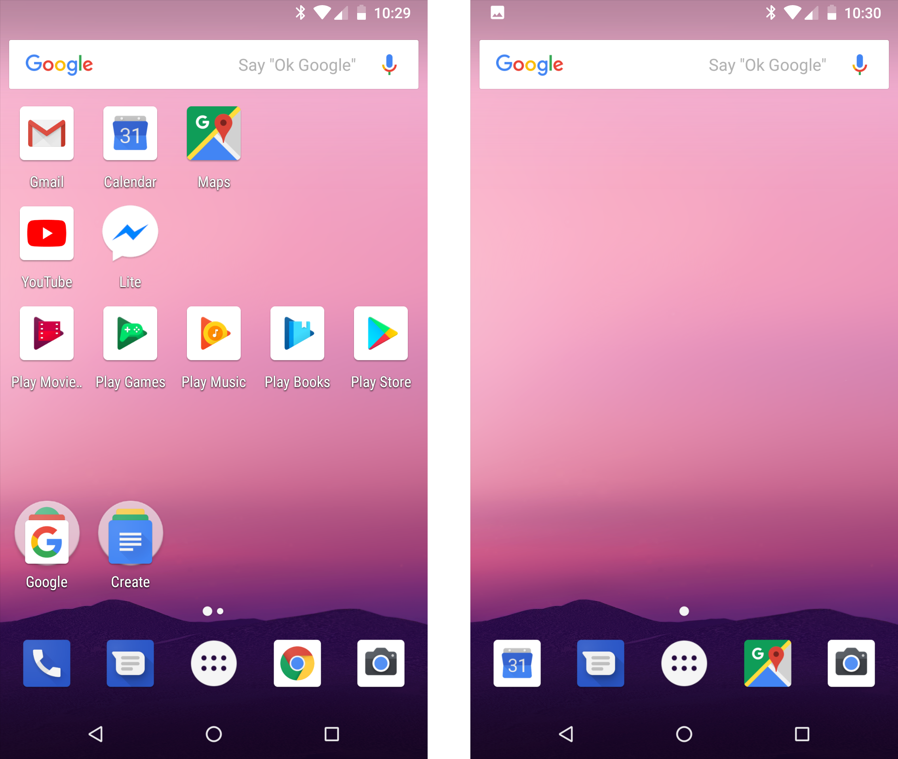
> _Home screen, before and after_

### Nova launcher
Use this custom Android launcher[^siempo] to remove the left-hand-side Google feed from the homescreen, and to remove the Google search bar.

<!--  nova launcher grid size -->

[^siempo]: I've been told there's also another launcher, called [Siempo](https://medium.com/@getsiempo/siempo-home-app-a-sneak-peek-8661f4724aa9), which is designed for mindful use. It's in Beta but looks  like it  has some cool features.

> 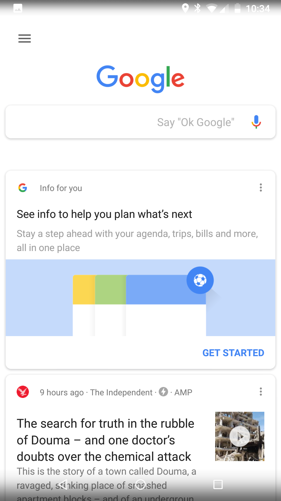
>
> _The left-hand-side Google feed_

> 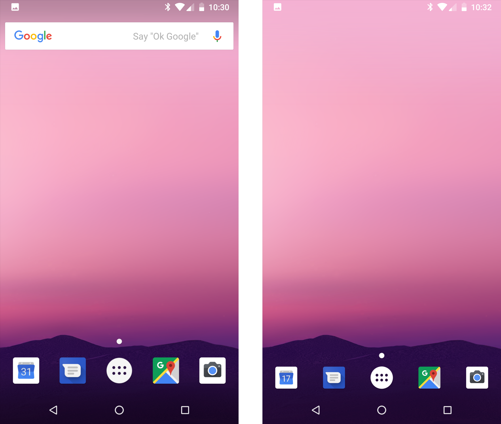
> _Removing the search bar with Nova Launcher, before and after_

Now comes my favourite part, the part where you make your phone as ugly as possible, while still retaining functionality. Take that, interface designers!

## Black and white
Go to [developer options](https://www.google.co.uk/search?q=enable+developer+options+android), then ``Hardware-accelerated rendering`` and set ``Simulate colour space`` to ``Monochrome``. Trust me on this one. You don't need colour. You don't need it to browse the web. You don't need it to take pictures.

> 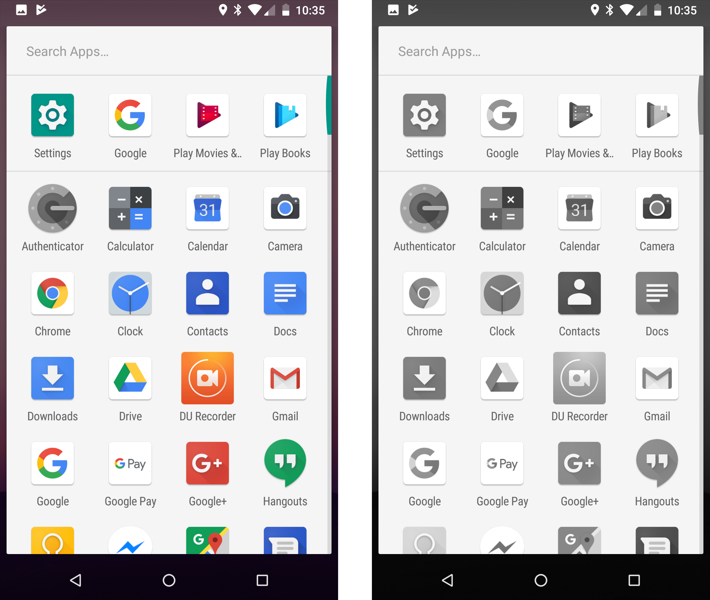
> _Black and white, before and after_

## No animations
Go to Developer options, ``Drawing``, and set all of
* ``Window animation scale``
* ``Transition animation scale``
* ``Animator duration scale``
to ``Animation off``. This will get rid of these smooth and pleasant animations, and make your phone feel more like Windows XP (in a good way).

>  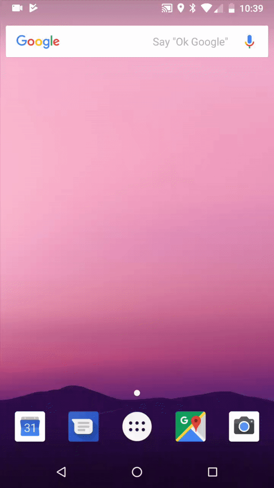
>
> _Animations, before and after_

## Layout bounds
Go to Developer options, ``Drawing``, and enable ``Show layout bounds``. This adds a little bit of extra ugliness, while actually improving usability because now you know exactly where each button is located on the screen.

> 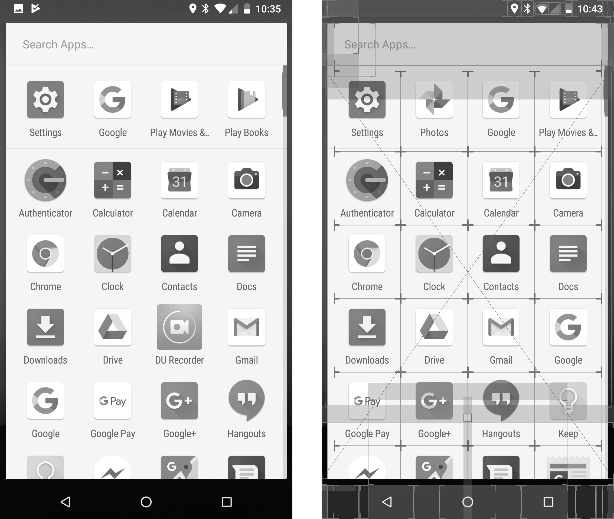
> _Layout bounds, before and after (black and white)_

## Debug GPU overdraw

Go to developer options, then ``Hardware-accelerated rendering`` and set ``Debug GPU overdraw`` to ``Show overdraw areas``.

> 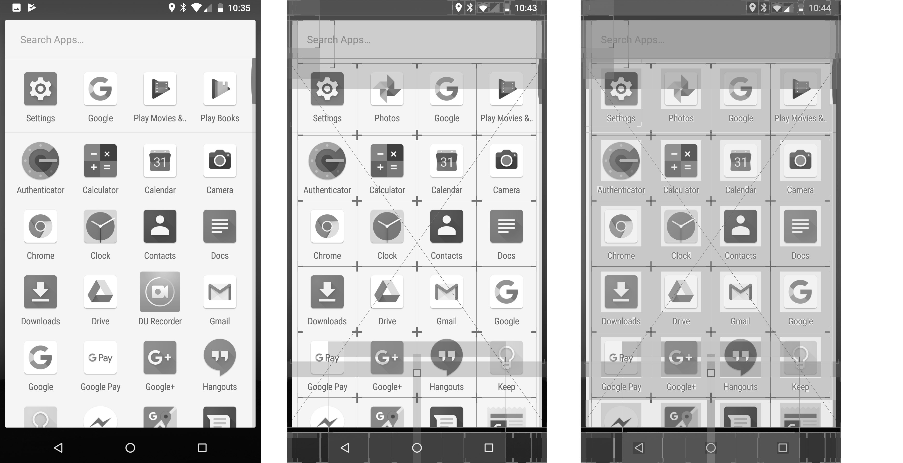
> _Default options, layout bounds, layout bounds + GPU overdraw (black and white)_

For some reason the layout bounds and GPU overdraw options are reset to default after a restart. I rarely restart my phone.

<!-- **Invert colours**. Go to ``Accessibility`` and under ``Experimental`` enable ``Colour inversion``. If you're already in Black and White, this won't affect the interface hugely, but the main benefit is that it makes pictures of people's faces look like evil demons. -->

# Facebook
Facebook is very [harmful in some ways, but beneficial in others](/facebook/). Here's what I like to use. (Many of these tips apply to most social media services).

## Delete the app from your phone
Duh. And if you find yourself using the mobile web interface, log out, set it to never remember your username or password, and pick a really long and annoying password. Because you can [sync](https://www.google.co.uk/search?q=sync+facebook+events+to+google+calendar) Facebook events to your Google calendar, I've found I honestly never have a legitimate need for Facebook on my phone.

> 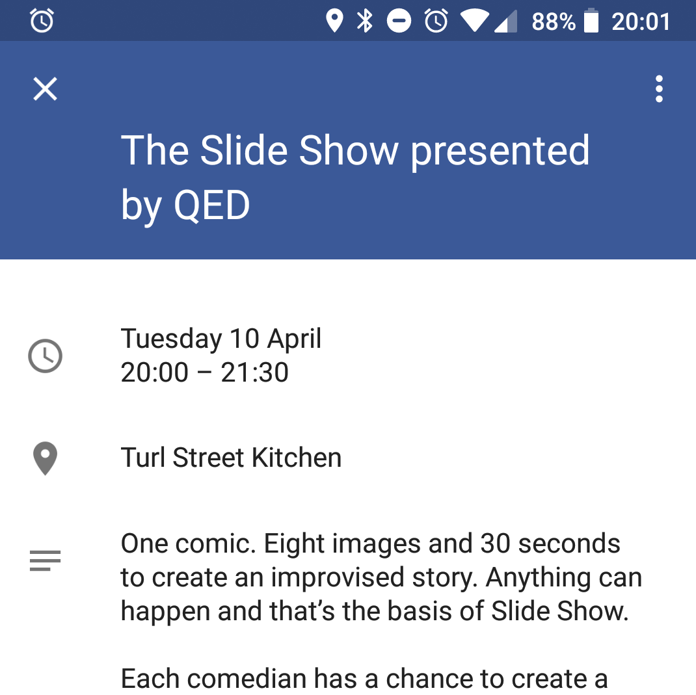
>
> _Facebook event on Google Calendar_

## In the browser
* Install [News Feed Eradicator](https://chrome.google.com/webstore/detail/news-feed-eradicator-for/fjcldmjmjhkklehbacihaiopjklihlgg?hl=en) on your browser. This one is great if you manage to make it to the point where you don't regularly circumvent it. That took me a while, and during that time it wasn't so useful, but now I haven't used the  news feed in over a year and it's been the biggest improvement for me.
* Install [Stylish](https://chrome.google.com/webstore/detail/stylish-custom-themes-for/fjnbnpbmkenffdnngjfgmeleoegfcffe?hl=en) and then get the following styles for it:
  * [Facebook dull notification count](http://userstyles.org/styles/133753)
  * [Facebook events focus](https://userstyles.org/styles/109511/facebook-events-focus)
  * [Facebook hide chat](https://userstyles.org/styles/128439/facebook-hide-chat). Then completely stop using facebook.com for chats. Only use [messenger.com](http://messenger.com)
  * [Facebook post interlude](https://userstyles.org/styles/127266/facebook-post-interlude)
  * [Facebook: Hide X NEW POSTS on friend grid](https://userstyles.org/styles/138302/facebook-hide-x-new-posts-on-friend-grid)

Here's their combined effect:

>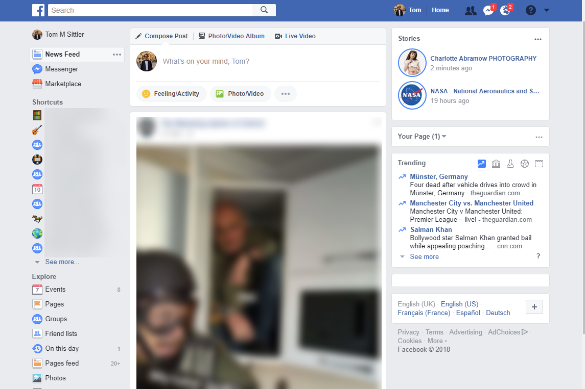
>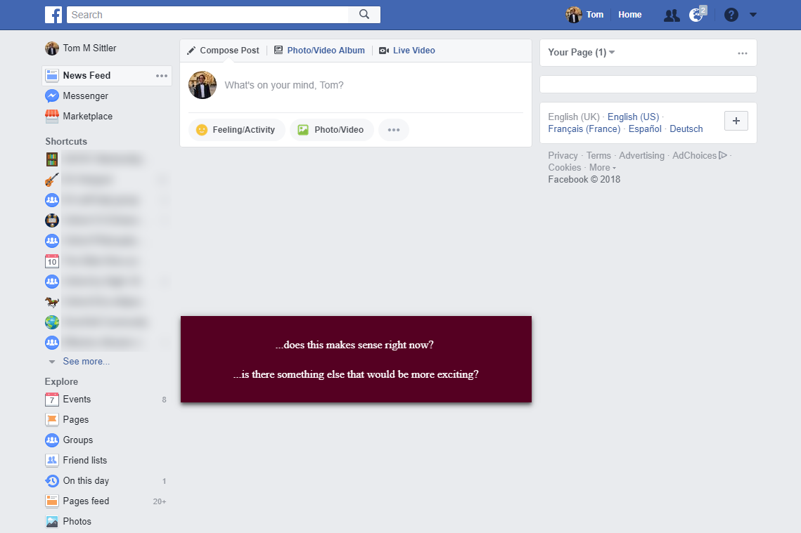
> _Facebook: before and after_

## Buffer
If you just want to post a status update, do it through [Buffer](buffer.com) instead of going to Facebook and giving it another opportunity to suck you in. Web and Mobile.

## Messenger Lite
I _loathe_ "My day". Thankfully there's [Messenger lite](https://play.google.com/store/apps/details?id=com.facebook.mlite&hl=en_GB), which removes "My Day", and a bunch of other crap.

> 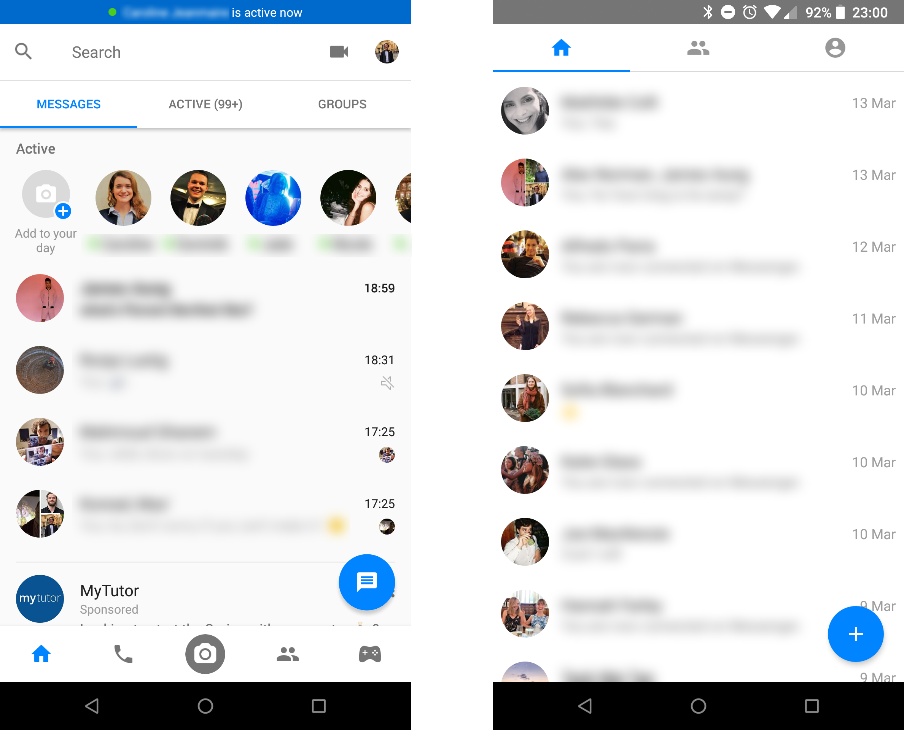
> _Facebook messenger, before and after_

## Turn off 'Active now'
In messenger, it's in `Settings`, then `Availability`.

# Browser
## Delayed gratification
**Install [Delayed Gratification](https://chrome.google.com/webstore/detail/delayed-gratification/ifhndomfnbmggdgodaicfebeggdphlcn?hl=en)** for distracting websites. The key thing here is that the 15-30 second delay gives you a chance to reconsider and close the tab, but since it's only a delay you're not tempted to circumvent the tool.

> 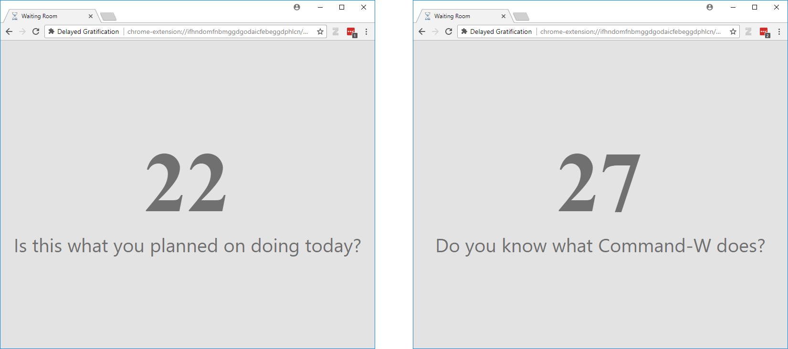
> _Delayed Gratification_

## Ascetic monk mode
This stylish [extension](http://userstyles.org/styles/155392) immediately turns you into an Enlightened One, or comes close.

> 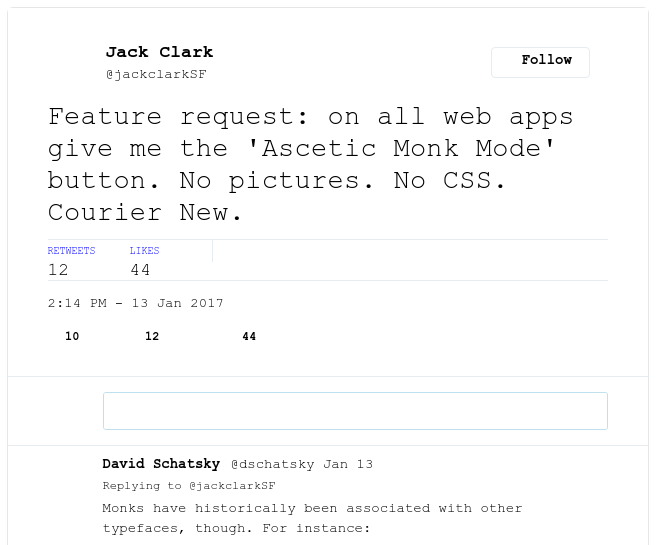
> _Ascetic monk mode_

More generally, with custom stylish extensions, the sky is the limit for customising the web, but that requires some fiddling with css. Consider using my [fork](http://userstyles.org/styles/155392) of ascetic monk mode.

# Windows
## Block distracting services
This is where most of the action for this section will happen. Use a programme like Cold Turkey (Windows) or Self-Control (Mac) to block distractions. This is some deep-level blocking. You can’t circumvent it short of reinstalling the operating system, I think. So start with small experiments, and work your way up.

I'll give more detail only about Cold Turkey, since that's what I know. Cold Turkey can block both ``.exe`` programmes and websites. You can set different block lists and schedule your lists to automatically activate during certain times. I've found it useful to have three lists:
* _Quit entirely_, for websites that provide no conceivable value
* _Distractions_, the main list, for distractions like Facebook, Twitter, etc.
* _Deep work_. When doing a [deep work](https://80000hours.org/2016/08/is-deep-work-the-most-underappreciated-skill-for-career-success-an-interview-with-cal-newport/) session on a single project, I sometimes use this to block everything except a few project-relevant websites for the duration of the session.

For _Quit entirely_, go to ``Timers`` and block the list until 2021 or something.

For _Distractions_, go to ``Schedule`` and block them for a few hours a day at first. Remember, it's a negotiation between you and the monkey, not an all-out war. These are seriously addictive products. If you block them totally, you might actually re-install the whole OS, or more likely find another device to log in from. What worked for me is to slowly increase the daily window of time during which this list is blocked.

Block _Deep work_ for a few hours as needed.

Don't forget to go to ``Settings`` to lock the schedule.

> 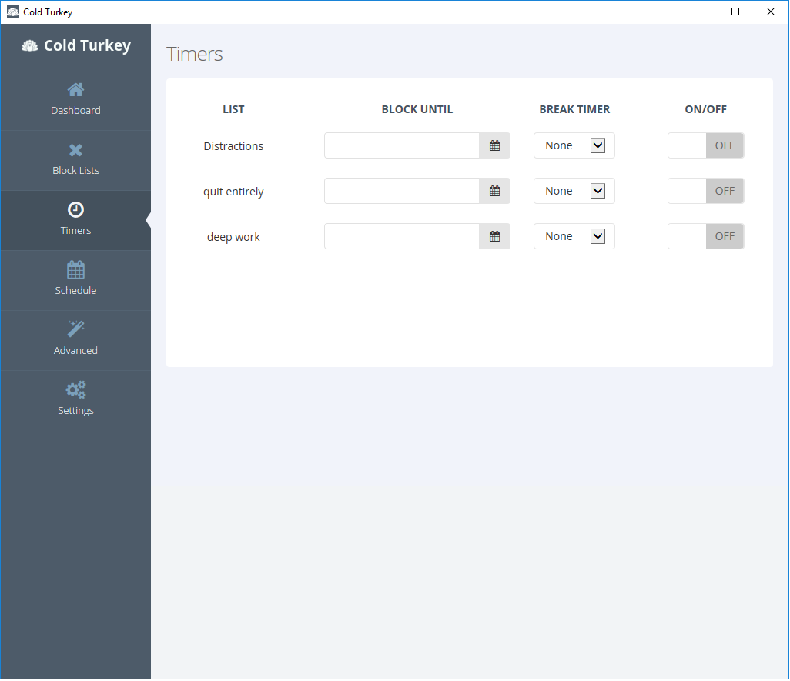
> _Cold Turkey_

## Strip down the start menu, taskbar, and desktop
Remove shortcuts and tiles for all but the least distracting apps. I've removed all shortcuts except Chrome, and all tiles except the calendar and weather tiles.

> 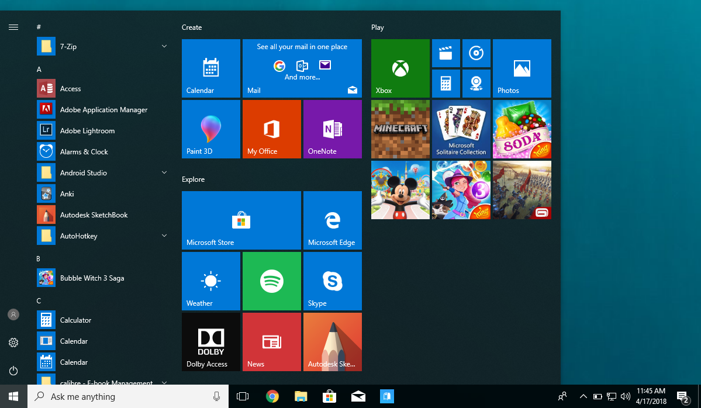
> 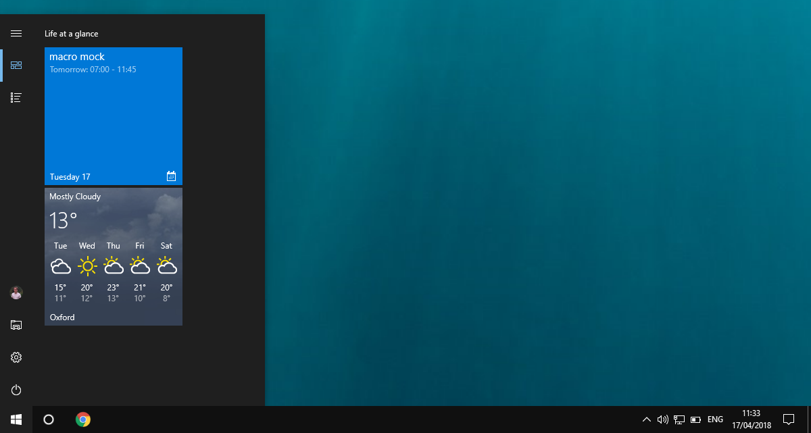
> _Start menu and taskbar, before and after_

## Single-use instances for webapps
When you use webapps like Gmail or Google Calendar in a normal browser window, there are several visual cues encouraging you to get distracted: the new tab button, and the address bar (which likely suggests facebook when you type the single letter ``f``). Instead, use a dedicated window. In Chrome, you need to go to the Settings menu, and then ``More tools`` and ``Add to desktop``. Don't forget to delete the shortcut from your desktop (use search instead). (Personally I've created my own [electron wrappers](https://github.com/jiahaog/nativefier) instead of Chrome, which uses a lot of memory if you have a lot of extensions.)

> 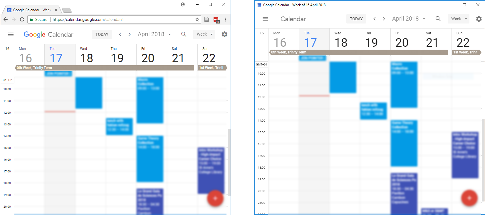
> _Google Calendar, in the browser and as a single-use instance_

If you're still here, congratulations on making it to the end! I wish you contentment and calm.

 <!-- hr to be added before footnotes-->
