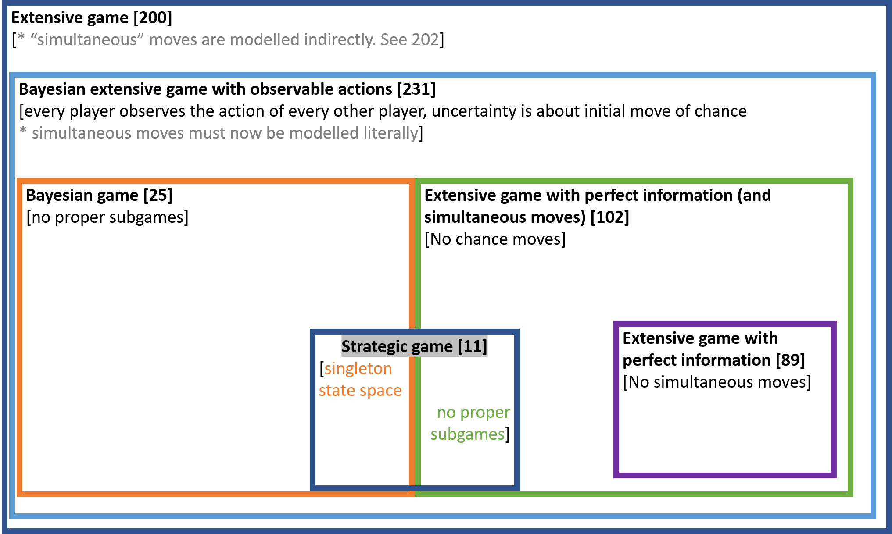

The basic notion of strategic game can be extended in two directions: adding imperfect information, and adding sequential moves. This gives nice matryoshka dolls of types of games, depicted below with page numbers in Osborne and Rubinstein (OR) in brackets.

Each type of game has a solution concept that is arguably natural to it. 

| **Game**                                                         | **Natural solution concept**                                     |
| ------------------------------------------------------------ | ------------------------------------------------------------ |
| Extensive game                      | Sequential equilibrium [225.1]|
| Bayesian extensive game with observable actions              | Perfect Bayesian equilibrium [231.1]                         |
| Extensive game with perfect information (and simultaneous moves) | Subgame perfect equilibrium [97.2]                           |
| Bayesian Game                                                | Bayesian-Nash equilibrium [26.1]                             |
| Strategic game                                               | Mixed-strategy Nash equilibrium [32.3] or Nash equilibrium [14.1] |

Applying the solution concept of a more general game to a more specific game can always be done, but it is uninteresting. For example, all Nash equilibria of a strategic game are trivially subgame perfect, and trivially Bayesian. 

We can also apply the solution concept of a more specific game to a more general game, for example, we can find the Nash equilibria of a game with sequential moves; some of these will not be subgame perfect. Suppose we wanted to do the same thing with Bayesian games. I found that this does not work straight out of the box when using the definitions from OR and other standard textbooks. We will need to make some small changes. In 26.1, OR make the following definition[^ordef]:

> A Nash equilibrium of a Bayesian game with vNM preferences $$\langle N, \Omega,(A_i), (T_i), (s_i), (p_i), (u_i) \rangle$$ is a Nash Equilibrium of the strategic game with vNM preferences defined as follows:
> 
> * The set of players is the set of all pairs $$(i,t_i)$$ for $$i \in N$$ and $$t_i \in T_i$$
> 
> * For each player $$(i,t_i)$$, the set of actions is $$A_i$$
> 
> * For each player $$(i,t_i)$$, the preference function assigns to action $$a_i$$ the payoff
> 
> $$\sum_{\omega \in \Omega} p_i(\omega \mid t_i )u_i [(a_i,\hat{a}_{-i}(\omega)), \omega ]$$ 
> 
> where $$\hat{a}_{-i}(\omega)$$ is the profile of actions taken by every player $$(j,s_j(\omega)), j \neq i$$ in state $$\omega$$. 

[^ordef]: Well, actually, the definition they make is more complicated, since it applies in general to any preference ordering $$\succsim_i$$ rather than only to vNM preference orderings $$u_i$$. But I have simplified their definition (adapting from 281.2 in Osborne) to avoid a complication that would be completely besides the point. The original OR definition is: .

For the purpose of seeing the relationships between solution concepts, calling this a "Nash equilibrium" is unfortunate. When we introduce extensive games, we give a new name, "subgame perfect equilibrium" to its natural solution concept. So why re-use the name "Nash equilibrium" for the solution concept of Bayesian games? It would be preferable to call 26.1 a *Bayesian-Nash equilibrium of a Bayesian game*, as distinct from a Nash equilibrium of a Bayesian game in which the players do not condition on their type. That is, in what I propose to call a Nash equilibrium of a Bayesian game, players choose an unconditional strategy, and their utilities correspond to the expected utilities using their prior over types. Picture the players before they receive their signals. They have some prior over the signals they and their opponents will receive. They can average over this uncertainty and decide on a strategy. If these unconditional strategies are best responses to each other, we have a Nash equilibrium. On this definition, a Nash equilibrium of a Bayesian game ignores all the properly Bayesian features of the game, just like a Nash equilibrium of a sequential game ignores all the sequential information. Why wouldn't you condition on your type? You would if you were rational! But if you were rational you would also never play a non-subgame perfect Nash equilibrium strategy. Yet we still find it useful to have the specific name "subgame perfect equilibrium of an extensive game".

Given these definitions, we can find:
* the Bayesian Nash equilibria of a Bayesian extensive game with observable actions; some of these will not be subgame perfect.
* the perfect Bayesian equilibria of an extensive game; in some of these the off-equilibrium-path beliefs will not be consistent [Lecture 8]
* the Nash equilibria of a Bayesian game; some of these will be such that some player-types, if they did condition on their type, would not be best-responding.
* and so on

This gives us this diagram: 

Notice that we really could not have put all the solution concepts on one diagram if we had been using the standard definition. It would not make sense to speak of the Nash equilibria of a general extensive game, as a proper superset of its Bayesian-Nash equilibria. We would have needed two separate diagrams, one for games of imperfect information, and one for games of perfect information. 

Here are some sources for the claims in the second diagram:
* By proposition 45.3, the set of correlated equilibria of G contains the set of mixed strategy Nash equilibria of G.
* By definition 32.3 of a mixed strategy Nash equilibrium, the set of mixed strategy Nash equilibria of G contains the set of Nash equilibria of G.
* Lemma 56.2 states that every strategy used with positive probability by some player in a correlated equilibrium of a finite strategic game is rationalisable.

 <!-- hr to be added before footnotes-->
<!--stackedit_data:
eyJoaXN0b3J5IjpbLTk2Mjc5NzYxNCwtMTg1MDIwMTIyMCw2Mz
QzODE1NTIsLTE0MjU5NjU3NDEsLTEwMTcwNzI5NTFdfQ==
-->